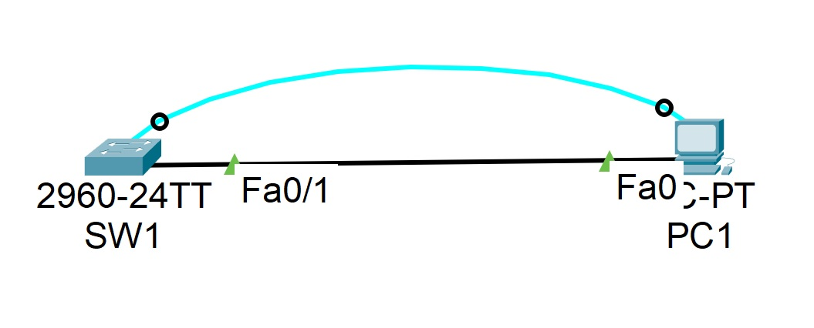

**_Лабораторная работа №01._**

*Базовая настройка коммутатора*

ТОПОЛОГИЯ

Таблица алресации
                    
Устройство    | Интерфейс    |  IP адресс \ префикс  |
------------- | -------------|-----------------------|
SW1           | VLAN1        |  192.168.1.2/24       |  
PC1           | NIC          |  192.168.1.10/24      |
-----------------------------------------------------

# 1. Создание сети и проверка настроек коммутатора по умолчанию в Cisco Packet Tracer (v.8.1.1)
1.1. Создаем сеть согласно топологии.

а. Подключаем консольным кабелем в программе к PC SW1

b. Устанавливаем соединение через консрот PC

    Почему нужно использовать консольное подключение для первоначальной настройки коммутатора? 
    - В коммутаторе установлены первоначальные заводские настройки, поэтому первоначальные настройки происходят через внеполосной кабель.
    Почему нельзя подключиться к коммутатору через Telnet или SSH? 
    - Коммутатору не присвоен IP-адрес

1.2. Проверяем настройки коммутатора по умолчанию

а. Просматриваем начальную конфигурацию устройства

        SW1>enable
        SW1#show running-config

b. Изучаем текущий файл running configuration.

     Сколько интерфейсов FastEthernet имеется на коммутаторе 2960? - 24
     Сколько интерфейсов Gigabit Ethernet имеется на коммутаторе 2960? - 2
     Каков диапазон значений, отображаемых в vty-линиях? - 2 диапазона 0-4 и 5-15

c. Изучаем файл загрузочной конфигурации (startup configuration), который содержится в энергонезависимом ОЗУ (NVRAM).

     Почему появляется это сообщение? - изначально этого файла нет в зафодской конфигурации, он появится позже когда мы закончим настройку и скопируем running-config в startup-configuration

d.	Изучаем характеристики SVI для VLAN 1.

    Назначен ли IP-адрес сети VLAN 1? - изначальнов в заводской настройке не назначен, лишь только когда мы зайдем в SW(config-if) (настройка интерфейса vlan), там мы присваиваем ip адрес SVI
    Какой MAC-адрес имеет SVI? - т.к. это виртуальный интерфейс то он не имеет MAC-адреса, однако его можно присвоить
    Данный интерфейс включен? - изначально выключен но после присвоения интерфесу IP-адреса его надо активировать коммандой "no shutdown"

e.	Изучаем IP-свойства интерфейса SVI сети VLAN 1

    Какие выходные данные вы видите? 
    Последовательно вводим команды:
     
        Switch#show vlan brief
        Switch#show ip interface brief 
     
     Все порты находятся в состоянии "down", а vlan1 административно отключен.

f.	Подсоединим кабель Ethernet компьютера PC-A к порту 1 на коммутаторе и изучим IP-свойства интерфейса SVI сети VLAN 1. Дождемся согласования параметров скорости и дуплекса между коммутатором и ПК.

    Какие выходные данные вы видите?
    Последовательно вводим команды:
     
        Switch#show vlan brief
        Switch#show ip interface brief 
     
    Порты находятся в состоянии "down", 1й порт в сотоянии "up", а vlan1 административно отключен.

g.	Изучим сведения о версии ОС Cisco IOS на коммутаторе.

    Введем комманду:

        Switch#show version 

    Под управлением какой версии ОС Cisco IOS работает коммутатор? - 15.0(2)SE4 
    Как называется файл образа системы? - C2960-LANBASEK9-M

h.	Изучите свойства по умолчанию интерфейса FastEthernet, который используется компьютером PC1.

    Введем комманды:

        Switch#show interface f0/1
        Switch#show mac address-table

    Интерфейс включен или выключен? - включен
    Что нужно сделать, чтобы включить интерфейс? - ничего
    Какой MAC-адрес у интерфейса? - 000a.41e1.4e01 он одинаковый для всех интерфейсов по умолчанию (но его можно позже поменять)
    Какие настройки скорости и дуплекса заданы в интерфейсе? - Full-duplex, 100Mb/s

i.	Изучите флеш-память
    
    Введем комманду:

        Switch#show flash

    Какое имя присвоено образу Cisco IOS? - 2960-lanbasek9-mz.150-2.SE4.bin

-----------------------------------------------------

# 2. Настройка базовых параметров сетевых устройств

2.1. Настройте базовые параметры коммутатора

а. Настраиваем в режиме глобальной конфигурации switch

    Switch(config)#no ip domain-lookup
    Switch(config)#hostname SW1
    SW1(config)#service password-encryption
    SW1(config)#enable secret class
    SW1(config)#banner motd # Unauthorized access is strictly prohibited. #

b.	Назначим IP-адрес интерфейсу SVI на коммутаторе. 

    SW1(config)#interface vlan 1
    SW1(config-if)#ip address 192.168.1.2 255.255.255.0
    SW1(config-if)#no shutdown

с. Проводим настройку консоли: ограничиваем доступ паролем и изменяем параметр чтобы консольные сообщения не прерывали комманд:

    SW1(config-if)#no shutdown
    SW1(config-line)#password cisco
    SW1(config-line)#login
    SW1(config-line)#logging synchronous 

d.	Настроим каналы виртуального соединения для удаленного управления (vty) через Telnet.

    SW1(config)#line vty 0 15
    SW1(config-line)#password class
    SW1(config-line)#login
    SW1(config-line)#transport input telnet 

    Для чего нужна команда login? - активация запроса пароля на вход в текущую ветку настройки конфигурации коммутатора

2.2. Настройте IP-адрес на компьютере PC1
На логической схеме нашей схемы заходим в настройки PC1 и во вкладке CONFIG прописываем STATIC\FastEternet сетевые настройки:

        IP: 192.168.1.10
        NM: 255.255.255.0

-----------------------------------------------------

# 3. Проверка сетевых подключений

3.1. Просмотрим конфигурацию коммутатора.

    SW1#show running-config 
    SW1#show interfaces vlan1

Какова полоса пропускания этого интерфейса? - В строке
    MTU 1500 bytes, BW 100000 Kbit, DLY 1000000 usec
    видно что скорость 100Мбит\с

3.2. Протестируем сквозное соединение, отправив эхо-запрос.
- заходим в коммандную строку PC1 и вводим комманду

        C:\> ping 192.168.1.2

- заходим в коммутатор и вводим комманду

        SW1#ping 192.168.1.10

        

        
        

