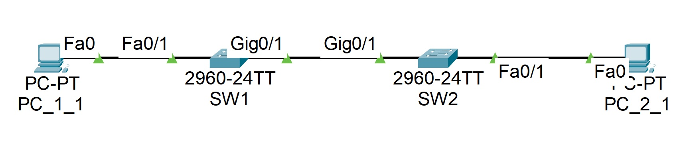
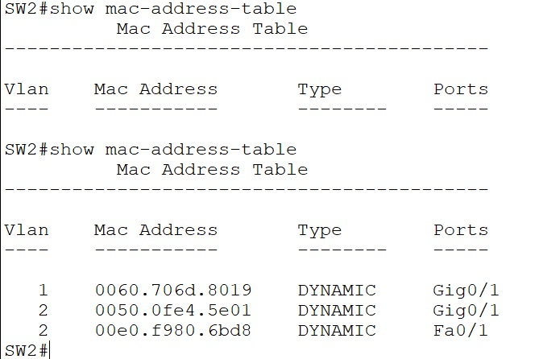
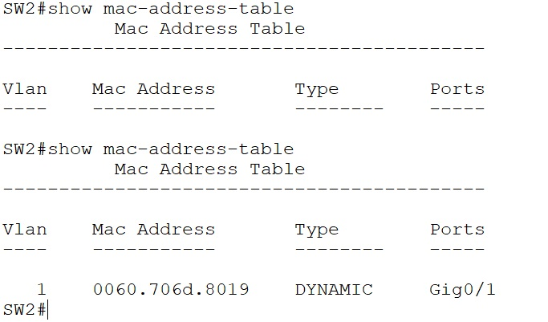

**_Лабораторная работа №02._**

*Просмотр таблицы MAC-адресов коммутатора*

ТОПОЛОГИЯ

Таблица алресации
                    
Устройство| Интерфейс|      IP адресс   |   Маска подсети  |
----------| ---------|------------------|------------------|
SW1       | VLAN1    |  192.168.1.11/24 |   255.255.255.0  |  
SW2       | VLAN1    |  192.168.1.12/24 |   255.255.255.0  |  
PC_1_1    | NIC      |  192.168.1.1/24  |   255.255.255.0  |
PC_2_1    | NIC      |  192.168.1.2/24  |   255.255.255.0  |
------------------------------------------------------------

# 1. Создание и настройка сети
    Выполнена базовая настройка сети (коммуиаторов и ПК), основанная на лабораторной работе №1. Разделив текущую конфигурацию на 2 сети SW1 + PC_1_1 & SW2 + PC_2_1 провели аналогичную работу.

-----------------------------------------------------

# 2. Часть 2. Изучение таблицы МАС-адресов коммутатора

2.1. Запишем МАС-адреса сетевых устройств.

а. Откроем командную строку на PC_1_1 и PC_2_1 и введем команду ipconfig /all. Физические адреса адаптера Ethernet:
    MAC-адрес компьютера PC_1_1: 0030.A3DB.DC77
    MAC-адрес компьютера PC_2_1: 00E0.F980.6BD8
    
b.	Подключимся к коммутаторам SW1 и SW2 и введеv команду show interface F0/1 на каждом коммутаторе. Fдреса оборудования во второй строке выходных данных команды (или зашитый адрес — bia):
    МАС-адрес коммутатора SW1 Fast Ethernet 0/1: 0060.706d.8001
    МАС-адрес коммутатора SW2 Fast Ethernet 0/1: 0090.2bc7.3001
    
2.2. Просмотриv таблицу МАС-адресов коммутатора.
Подключимся к коммутатору SW2 просмотрим таблицу МАС-адресов до и после тестирования сетевой связи с помощью эхо-запросов (PING).

Изначально в таблице МАС-адресов коммутатора ничего нет, после того как PC_2_1 подал эхо-запроc на РС_1_1 в таблицу добавились адреса этих ПК.

2.3. Очистим таблицу МАС-адресов коммутатора S2 и снова отобразим таблицу МАС-адресов.

    a.	В привилегированном режиме выполним команду:
        SW2# clear mac address-table dynamic
        Результатом будет вывод того что таблица адресов обнулилась
    b.	Повторно введем команду:
        SW2# show mac address-table 
        Появился адрес гигабитного порта коммутатора

    P/S/ Повторная отправка эхо запроса но уже с РС_1_1 на РС_2_2  к скрину отраженному на скрине п.2.2 добавит MAC-адрес гигабитного порта SW1

2.4. С PC_2_1 отправьте эхо-запросы устройствам в сети и просмотрим таблицу МАС-адресов коммутатора.

    a.На PC_2_1 в командной строке введем команду arp -a.
    Получим пару адресов РС_1_1

    b.	Из командной строки PC_2_1 отправим эхо-запросы на компьютер PC_1_1, а также коммутаторы SW1 и SW2.
    Получим ответы от всех устройств нашей сети.

    c.	На коммутаторе SW2, введем команду:
            SW2# show mac address-table 

        На ПК РС_2_1 выполним комманду:
            C:\>arp -a

        Появились адреса всех устройст сети кромеме адреса отправлявшего запрос.

	Вопрос для повторения: 
    В сетях Ethernet данные передаются на устройства по соответствующим МАС-адресам. Для этого коммутаторы и компьютеры динамически создают ARP-кэш и таблицы МАС-адресов. Если компьютеров в сети немного, эта процедура выглядит достаточно простой. Какие сложности могут возникнуть в крупных сетях?
    - В больших сетях более 300 ПК будет наблюдаться рост трафика за счет arp-запросов в результате большой нагрузки сеть как минимум замедлит скорость передачи данных и как максимум перестанет выполнять свои функции.

