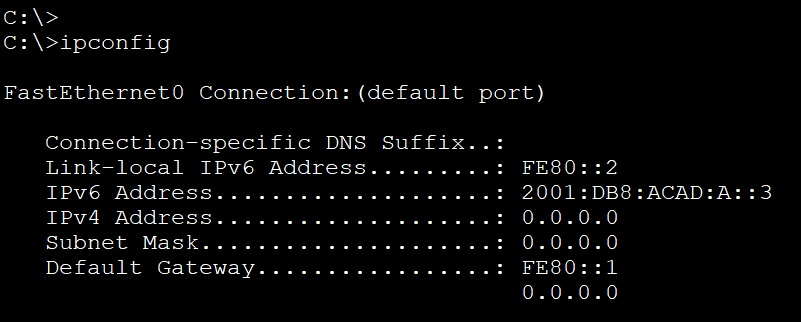
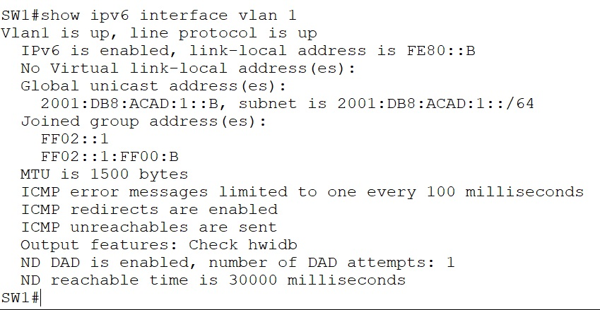
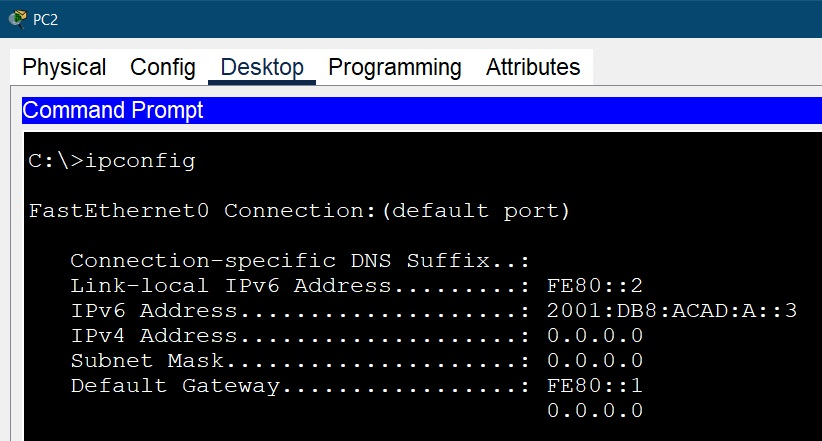
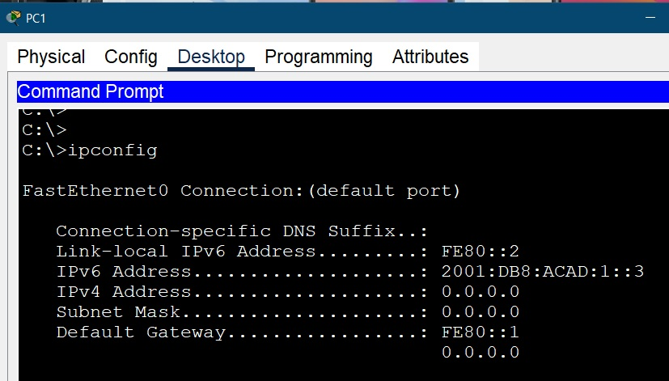
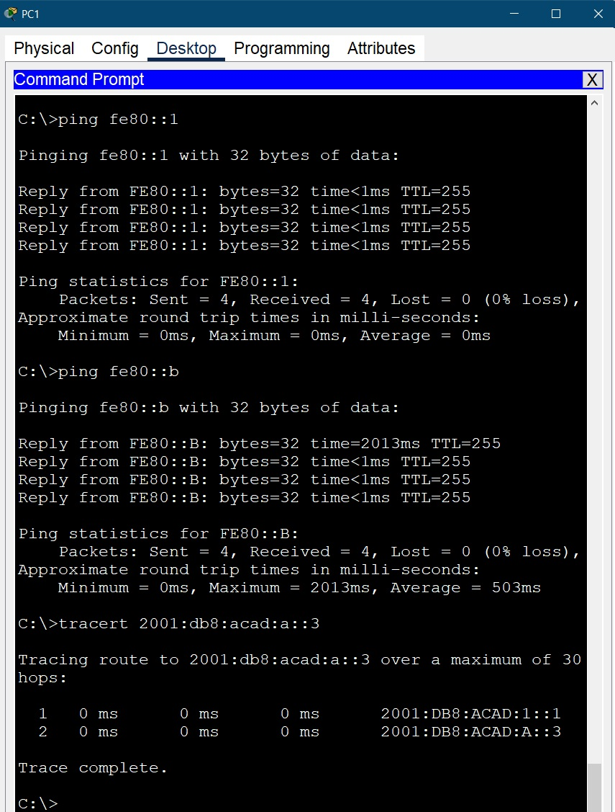
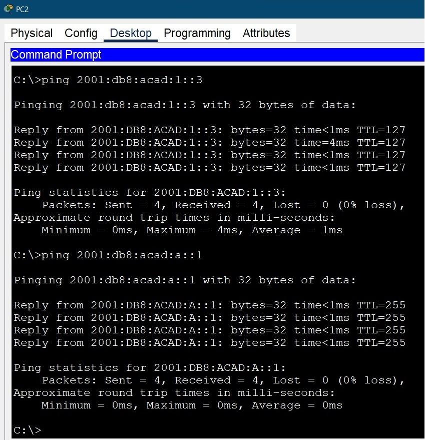

**_Лабораторная работа №04._**

*IPv6 адресация*

ТОПОЛОГИЯ

Таблица алресации
                    
Устройство| Интерфейс|    IPv6 адресс     |      LLA IPv6    |  Префикс  |    Шлюз    |
----------| ---------|--------------------|------------------|-----------|------------|
R1        | G0/0/0   | 2001:db8:acad:a::1 |     fe80::1      |     64    |     ---    |
R1        | G0/0/1   | 2001:db8:acad:1::1 |     fe80::1      |     64    |     ---    |   
SW1       | VLAN1    | 2001:db8:acad:1::b |     fe80::b      |     64    |     ---    |
PC1       | NIC      | 2001:db8:acad:1::3 |     SLAAC        |     64    |   fe80::1  |
PC2       | NIC      | 2001:db8:acad:a::3 |     SLAAC        |     64    |   fe80::1  |
-------------------------------------------------------------

# Задачи
    Часть 1. Настройка топологии и конфигурация основных параметров маршрутизатора и коммутатора
    Часть 2. Ручная настройка IPv6-адресов
    Часть 3. Проверка сквозного соединения

Примечание: вместо указанного в задании роутера Cisco 4221 (отсутствует в оборудовании) использован Cisco 4231

-----------------------------------------------------

# Часть 1. Настройка топологии и конфигурация основных параметров маршрутизатора и коммутатора

1.1. Настройка маршрутизатора
    
    ROUTER(config)# hostname R1 
    R1(config)#ip domain-name R1
    R1(config)#ip ssh version 2
    R1(config)#crypto key generate rsa general-keys modulus 1024
    R1(config)#username admin privilege 15 secret cisco
    R1(config)#enable secret class 
    R1(config)#ipv6 unicast-routing 
    R1(config)#service password-encryption
    R1(config)#no ip domain-lookup	
    R1(config)#banner motd #!Get out from here!#
    R1(config)# line console 0
    R1(config-line)# password cisco
    R1(config-line)# login	
    R1(config)#line vty 0 15
    R1(config-line)#password cisco
    R1(config-line)#login
    R1(config-line)#transport input ssh 
    R1(config-line)#exec-timeout 0 15
    R1(config)#line aux 0
    R1(config-line)#login

1.2. Настройка коммутатора.

    SWITCH(config)# hostname SW1 
    SW1(config)#ip domain-name SW1
    SW1(config)#ip ssh version 2
    SW1(config)#crypto key generate rsa general-keys modulus 1024
    SW1(config)#username admin privilege 15 secret cisco
    SW1(config)#enable secret class 
    SW1(config)#sdm prefer dual-ipv4-and-ipv6 default
    SW1(config)#service password-encryption
    SW1(config)#no ip domain-lookup	
    SW1(config)#banner motd #!Get out from here!#
    SW1(config)# line console 0
    SW1(config-line)# password cisco
    SW1(config-line)# login	
    SW1(config)#line vty 0 15
    SW1(config-line)#password cisco
    SW1(config-line)#login
    SW1(config-line)#transport input ssh 
    SW1(config-line)#exec-timeout 0 15
    

# Часть 2. Ручная настройка IPv6-адресов

2.1. Назначим IPv6-адреса интерфейсам Ethernet на R1.

    R1(config-if)#int g0/0/0
    R1(config-if)#ipv6 enable   
    R1(config-if)#ipv6 address 2001:db8:acad:a::1/64
    R1(config-if)#ipv6 address fe80::1 link-local
    R1(config-if)#no shutdown
    R1(config-if)#int g0/0/1
    R1(config-if)#ipv6 enable   
    R1(config-if)#ipv6 address 2001:db8:acad:1::1/64
    R1(config-if)#ipv6 address fe80::1 link-local
    R1(config-if)#no shutdown

Проверяем, назначен ли каждому интерфейсу корректный индивидуальный IPv6-адрес.
Также прописываем в интерфесе Cisco Packet Tracer IPv6 адреса для обоих интерфейсов

Вопрос: Какие группы многоадресной рассылки назначены интерфейсу G0/0?
    
    Ответ : Группы многоадресной рассылки можно посмотреть при помощи комманд
    show ipv6 interface и
    show ip igmp groups

2.2. Активация IPv6-маршрутизацию на R1

Сделано в 1.1 (IPv6 unicast-routing). 

Проверяем данные на РС2

Вопрос: Почему PC2 получил глобальный префикс маршрутизации и идентификатор подсети, которые вы настроили на R1?
    
    Ответ : Т.к. мы включили SLAAC, он и отрабатывает так назначение IPv6 при запросе к нему. Первые 64 бита он берет из свего адреса, которые и являются префиксом маршрутизации и индентификатором подсети.

2.3. Назначьте IPv6-адреса интерфейсу управления (SVI) на SW1.

    SW1(config-if)#int vlan 1
    SW1(config-if)#ipv6 addr 2001:db8:acad:a::1/64
    SW1(config-if)#ipv6 addr fe80::b link-local
    SW1(config)#ipV6 route ::/0 2001:db8:acad:1::1	- проброс пакетов на роутер после свитча
    SW1(config-if)#no shutdown
и проверяем настройку

2.4. Назначаеи через интерфейс указанные в таблице адреса на РС1 и РС2

и делаем проверку

# Часть 3. Проверка сквозного подключения

Соласно задания делаем запросы

Вопрос:	Почему обоим интерфейсам Ethernet на R1 можно назначить один и тот же локальный адрес канала — FE80::1?

    Ответ : Потому что FE80 это идентификатор LLA (Link Local adress) и он используется в локальных сетях, а т.к. у нас на интерфейсах 3 рахные подсети то для них можно использовать одинаковые адреса.

Вопрос: Какой идентификатор подсети в индивидуальном IPv6-адресе 2001:db8:acad::aaaa:1234/64?

    Ответ : адрес будет 2001:0db8:acad:0000:0000:0000:aaaa:1234 / 64
    Т.к. у нас маска сети 64 то берем первые 16 значений из адреса - 
    2001:0db8:acad:0000 (префикс)
    из которых 48 первых бит (12 значений) это префикс маршрутизации - 2001:0db8:acad
    и 16 бит (4 значения) это идентификатор подсети - 0000

