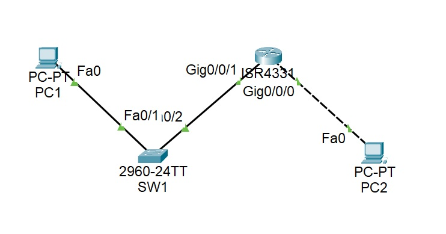
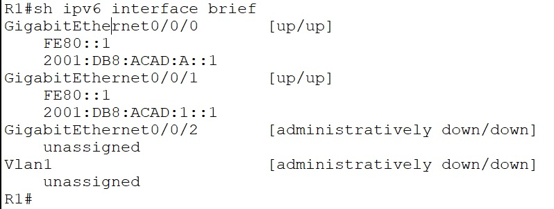
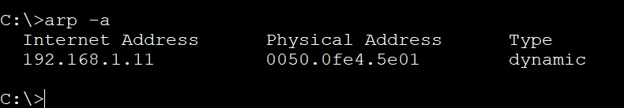
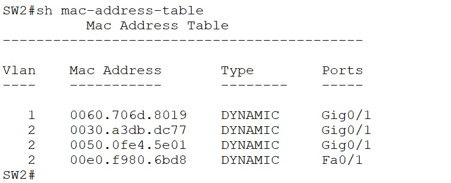
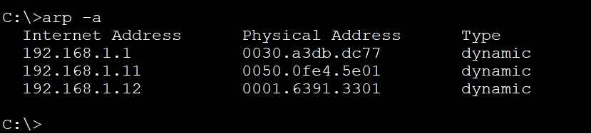

**_Лабораторная работа №04._**

*IPv6 адресация*

ТОПОЛОГИЯ

Таблица алресации
                    
Устройство| Интерфейс|    IPv6 адресс     |      LLA IPv6    |  Префикс  |    Шлюз    |
----------| ---------|--------------------|------------------|-----------|------------|
R1        | G0/0/0   | 2001:db8:acad:a::1 |     fe80::1      |     64    |     ---    |
R1        | G0/0/1   | 2001:db8:acad:1::1 |     fe80::1      |     64    |     ---    |   
SW1       | VLAN1    | 2001:db8:acad:1::b |     fe80::b      |     64    |     ---    |
PC1       | NIC      | 2001:db8:acad:1::3 |     SLAAC        |     64    |   fe80::1  |
PC2       | NIC      | 2001:db8:acad:a::3 |     SLAAC        |     64    |   fe80::1  |
-------------------------------------------------------------

# Задачи
    Часть 1. Настройка топологии и конфигурация основных параметров маршрутизатора и коммутатора
    Часть 2. Ручная настройка IPv6-адресов
    Часть 3. Проверка сквозного соединения

Примечание: вместо указанного в задании роутера Cisco 4221 (отсутствует в оборудовании) использован Cisco 4231

-----------------------------------------------------

# Часть 1. Настройка топологии и конфигурация основных параметров маршрутизатора и коммутатора

1.1. Настройка маршрутизатора
    
    ROUTER(config)# hostname R1 
    R1(config)#ip domain-name R1
    R1(config)#ip ssh version 2
    R1(config)#crypto key generate rsa general-keys modulus 1024
    R1(config)#username admin privilege 15 secret cisco
    R1(config)#enable secret class 
    R1(config)#ipv6 unicast-routing 
    R1(config)#service password-encryption
    R1(config)#no ip domain-lookup	
    R1(config)#banner motd #!Get out from here!#
    R1(config)# line console 0
    R1(config-line)# password cisco
    R1(config-line)# login	
    R1(config)#line vty 0 15
    R1(config-line)#password cisco
    R1(config-line)#login
    R1(config-line)#transport input ssh 
    R1(config-line)#exec-timeout 0 15
    R1(config)#line aux 0
    R1(config-line)#login

1.2. Настройка коммутатора.

    SWITCH(config)# hostname SW1 
    SW1(config)#ip domain-name SW1
    SW1(config)#ip ssh version 2
    SW1(config)#crypto key generate rsa general-keys modulus 1024
    SW1(config)#username admin privilege 15 secret cisco
    SW1(config)#enable secret class 
    SW1(config)#sdm prefer dual-ipv4-and-ipv6 default
    SW1(config)#service password-encryption
    SW1(config)#no ip domain-lookup	
    SW1(config)#banner motd #!Get out from here!#
    SW1(config)# line console 0
    SW1(config-line)# password cisco
    SW1(config-line)# login	
    SW1(config)#line vty 0 15
    SW1(config-line)#password cisco
    SW1(config-line)#login
    SW1(config-line)#transport input ssh 
    SW1(config-line)#exec-timeout 0 15
    

# Часть 2. Ручная настройка IPv6-адресов

2.1. Назначим IPv6-адреса интерфейсам Ethernet на R1.

    R1(config-if)#int g0/0/0
    R1(config-if)#ipv6 enable   
    R1(config-if)#ipv6 address 2001:db8:acad:a::1/64
    R1(config-if)#ipv6 address fe80::1 link-local
    R1(config-if)#no shutdown
    R1(config-if)#int g0/0/1
    R1(config-if)#ipv6 enable   
    R1(config-if)#ipv6 address 2001:db8:acad:1::1/64
    R1(config-if)#ipv6 address fe80::1 link-local
    R1(config-if)#no shutdown

скрине п.2.2 добавит MAC-адрес гигабитного порта SW1

2.4. С PC_2_1 отправьте эхо-запросы устройствам в сети и просмотрим таблицу МАС-адресов коммутатора.

    a.На PC_2_1 в командной строке введем команду arp -a.
    Получим пару адресов РС_1_1

    b.	Из командной строки PC_2_1 отправим эхо-запросы на компьютер PC_1_1, а также коммутаторы SW1 и SW2.
    Получим ответы от всех устройств нашей сети.

    c.	На коммутаторе SW2, введем команду:
            SW2# show mac address-table 

        На ПК РС_2_1 выполним комманду:
            C:\>arp -a

        Появились адреса всех устройст сети кромеме адреса отправлявшего запрос.

	Вопрос для повторения: 
    В сетях Ethernet данные передаются на устройства по соответствующим МАС-адресам. Для этого коммутаторы и компьютеры динамически создают ARP-кэш и таблицы МАС-адресов. Если компьютеров в сети немного, эта процедура выглядит достаточно простой. Какие сложности могут возникнуть в крупных сетях?
    - В больших сетях более 300 ПК будет наблюдаться рост трафика за счет arp-запросов в результате большой нагрузки сеть как минимум замедлит скорость передачи данных и как максимум перестанет выполнять свои функции.

