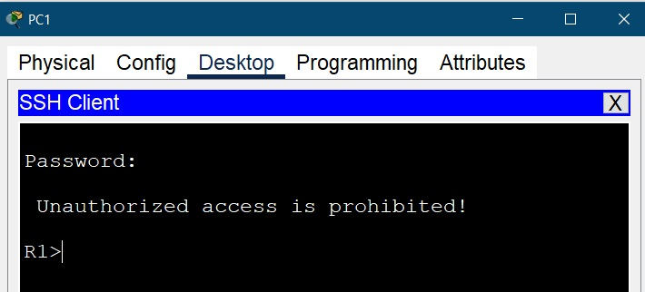
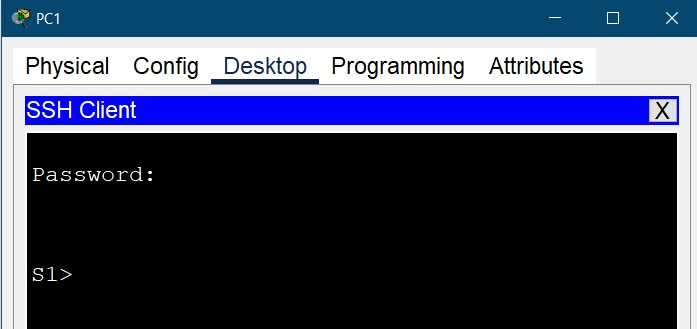

**_Лабораторная работа №06._**

*Внедрение маршрутизации между виртуальными локальными сетями*

ТОПОЛОГИЯ

Таблица алресации
                    
Устройство| Интерфейс |    IPv4 адресс     |  Маска подсети   |      Шлюз       |
----------| --------- |--------------------|------------------|-----------------|
R1        | G0/0/1.10 |   192.168.10.1     |  255.255.255.0   |          ---    |
R1        | G0/0/1.20 |   192.168.20.1     |  255.255.255.0   |          ---    |
R1        | G0/0/1.30 |   192.168.30.1     |  255.255.255.0   |          ---    |
R1        | G0/0/1.999|   -----------      |  255.255.255.0   |          ---    |
S1        | VLAN10    |   192.168.10.11    |  255.255.255.0   |   192.168.10.1  |
S2        | VLAN10    |   192.168.10.12    |  255.255.255.0   |   192.168.10.1  |
PC1       | NIC       |   192.168.20.3     |  255.255.255.0   |   192.168.20.1  |
PC2       | NIC       |   192.168.30.3     |  255.255.255.0   |   192.168.30.1  |
-------------------------------------------------------------

Таблица VLAN
                
VLAN      |    ИМЯ    |      Интерфейс                |                                     
----------| --------- |-------------------------------|                                     
10        | Management|   S1: VLAN10                  |                                    
10        | Management|   S2: VLAN10                  |                                    
20        | Sales     |   S1: F0/6                    |                                     
30        | Operations|   S2: F0/19                   |                                     
999       | Native    |   -------------               |                                     
100       | Self      |   -------------               |                                     
1000      | Parking   |   S1: F0/2-4, F0/7-24         |                                     
1000      | Parking   |   S2: F0/2-17, F0/19-24, G0/2 |                                     
-------------------------------------------------------------

# Задачи
    Часть 1. Создание сети и настройка основных параметров устройства
    Часть 2. Создание сетей VLAN и назначение портов коммутатора
    Часть 3. Настройка транка 802.1Q между коммутаторами.
    Часть 4. Настройка маршрутизации между сетями VLAN
    Часть 5. Проверка, что маршрутизация между VLAN работает

Примечание: вместо указанного в задании роутера Cisco 4221 (отсутствует в оборудовании) использован Cisco 4231

-----------------------------------------------------

# Часть 1. Настройка основных параметров устройств

1.1. Создали сеть согласно топологии

1.2. Выполним инициализацию и перезагрузку маршрутизатора и коммутатора.
Для этого ввести при входе комманды (при необходимости, если уст-ва ранее были сконфигурированы):

    write erase
    delete vlan.dat

1.3. Настройка маршрутизатора
    
    ROUTER(config)# hostname R1 
    R1(config)# ip domain-name R1
    R1(config)# ip ssh version 2
    R1(config)# crypto key generate rsa general-keys modulus 1024
    R1(config)# username admin privilege 15 secret cisco
    R1(config)# enable secret class 
    R1(config)# service password-encryption
    R1(config)# no ip domain-lookup	
    R1(config)# banner motd # Unauthorized access is prohibited! #
    R1(config)# line console 0
    R1(config-line)# password cisco
    R1(config-line)# login	
    R1(config)#line vty 0 15
    R1(config-line)#password cisco
    R1(config-line)#login local
    R1(config-line)#transport input ssh 
    R1(config-line)#exec-timeout 5 0
    R1(config)#line aux 0
    R1(config-line)#login
    R1(config-if)# int g0/0/1
    R1(config-if)# ip addr 192.168.1.1 255.255.255.0
    R1(config-if)# no shutdown
    R1# write memory (copy running-config startup-config)

1.4. Настройте компьютер PC1
В панели ПК вносим настройки согласно таблиц.

1.5. Проверка подключение к сети

# Часть 2. Настройка маршрутизатора для доступа по протоколу SSH
2.1 - 2.5 проделаны в 1.3.

2.6. Важно установлен 
     
     username: admin & password: cisco
     username: adm1nP & password: @55 - для проверки использования локальной базы пользователей

# Часть 3. Настройка коммутатора для доступа по протоколу SSH

3.1 - 3.2 Настройка коммутатора.

    SWITCH(config)# hostname S1 
    S1(config)# ip domain-name S1
    S1(config)# ip ssh version 2
    S1(config)# crypto key generate rsa general-keys modulus 1024
    S1(config)# username admin privilege 15 secret cisco
    S1(config)# username adm1nP privilege 15 secret @55
    S1(config)# enable secret class 
    S1(config)# service password-encryption
    S1(config)# no ip domain-lookup	
    S1(config)# banner motd # Unauthorized access is prohibited! #
    S1(config)# line console 0
    S1(config-line)# password cisco
    S1(config-line)# login	
    S1(config)#line vty 0 15
    S1(config-line)#password cisco
    S1(config-line)#login local
    S1(config-line)#transport input ssh 
    S1(config-line)#exec-timeout 5 0
    S1(config-if)# int vlan 1
    S1(config-if)# ip addr 192.168.1.11 255.255.255.0
    S1(config-if)# no shutdown
    S1# write memory
    
3.3. Важно установлен 
     
     username: admin & password: cisco
     username: adm1nP & password: @55 - для проверки использования локальной базы пользователей

# Часть 4. Настройка протокола SSH с использованием интерфейса командной строки (CLI) коммутатора

4.1 - 4.2. Установим соединение

Вопрос: Как предоставить доступ к сетевому устройству нескольким пользователям, у каждого из которых есть собственное имя пользователя?

    Ответ : требуется создать в локальной базе пользователей несколько пользователей и в интерфесей VTY прописать чтобы данные брались из этой базы

        S1(config)# username admin privilege 15 secret cisco
        S1(config)# username adm1nP privilege 15 secret @55
        S1(config)# line vty 0 15
        S1(config-line)# password cisco
        S1(config-line)# login local

Файл схемы сети [здесь](Lab_06/lab_06.pkt).

