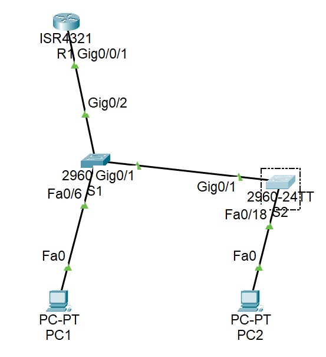
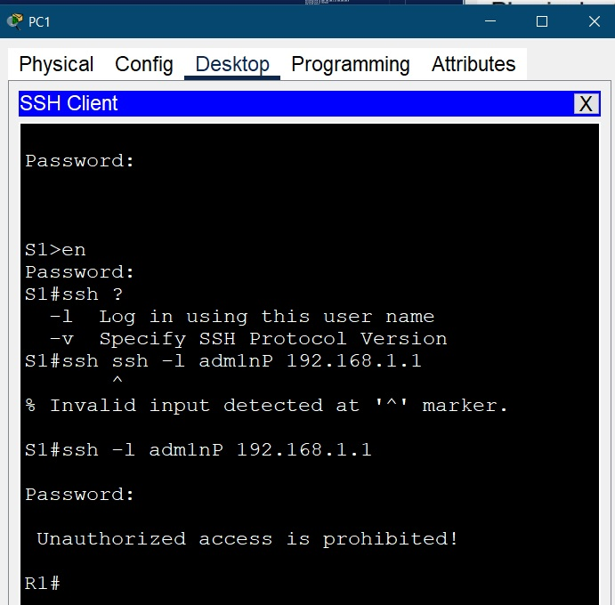

**_Лабораторная работа №06._**

*Внедрение маршрутизации между виртуальными локальными сетями*

ТОПОЛОГИЯ

Таблица алресации
                    
Устройство| Интерфейс |    IPv4 адресс     |  Маска подсети   |      Шлюз       |
----------| --------- |--------------------|------------------|-----------------|
R1        | G0/0/1.10 |   192.168.10.1     |  255.255.255.0   |          ---    |
R1        | G0/0/1.20 |   192.168.20.1     |  255.255.255.0   |          ---    |
R1        | G0/0/1.30 |   192.168.30.1     |  255.255.255.0   |          ---    |
R1        | G0/0/1.999|   -----------      |  255.255.255.0   |          ---    |
S1        | VLAN10    |   192.168.10.11    |  255.255.255.0   |   192.168.10.1  |
S2        | VLAN10    |   192.168.10.12    |  255.255.255.0   |   192.168.10.1  |
PC1       | NIC       |   192.168.20.3     |  255.255.255.0   |   192.168.20.1  |
PC2       | NIC       |   192.168.30.3     |  255.255.255.0   |   192.168.30.1  |
-------------------------------------------------------------

Таблица VLAN
                
VLAN      |    ИМЯ    |      Интерфейс                |                                     
----------| --------- |-------------------------------|                                     
10        | Management|   S1: VLAN10                  |                                    
10        | Management|   S2: VLAN10                  |                                    
20        | Sales     |   S1: F0/6                    |                                     
30        | Operations|   S2: F0/18                   |                                     
999       | Native    |   -------------               |                                     
100       | Self      |   -------------               |                                     
1000      | Parking   |   S1: F0/2-5, F0/7-24         |                                     
1000      | Parking   |   S2: F0/2-17, F0/19-24, G0/2 |                                     
-------------------------------------------------------------

# Задачи
    Часть 1. Создание сети и настройка основных параметров устройства
    Часть 2. Создание сетей VLAN и назначение портов коммутатора
    Часть 3. Настройка транка 802.1Q между коммутаторами.
    Часть 4. Настройка маршрутизации между сетями VLAN
    Часть 5. Проверка, что маршрутизация между VLAN работает

Примечание: вместо указанного в задании роутера Cisco 4221 (отсутствует в оборудовании) использован Cisco 4231

-----------------------------------------------------

# Часть 1. Настройка основных параметров устройств

1.1 - 1.4 Создали сеть согласно топологии
Базовая настройка роутера и коммутаторов на основве файла настроек.
Рекомендуется делать на окончательном этапе, чтобы часто не вводить пароли
Поменять: 

    hostname & ip domain-name 
соответствующие тому оборудованию на котором будет накатываться конфигурация

перед копированием и вставкой
Зайти в режим глобальной конфигурации

(config)# 

    service password-encryption
    !
    hostname S2
    !
    enable secret 5 $1$mERr$9cTjUIEqNGurQiFU.ZeCi1
    !
    no ip domain-lookup
    ip domain-name S2
    !
    username admin secret 5 $1$mERr$hx5rVt7rPNoS4wqbXKX7m0
    !
    banner motd # Unauthorized access is prohibited! #
    !
    line con 0
    password 7 0822455D0A16
    login
    exec-timeout 5 0
    !
    line vty 0 4
    exec-timeout 5 0
    password 7 0822455D0A16
    login local
    transport input ssh
    line vty 5 15
    exec-timeout 5 0
    password 7 0822455D0A16
    login local
    transport input ssh
    !
    end

Выполнить комманды

    (config)# crypto key generate rsa general-keys modulus 1024
    (config)# ip ssh version 2
    #w
    #reload
Генерация ssh-ключа на основе локальных данных конфигурации, переключение на новую версию ssh, сохранение и перезагрузка обррудования.

# Часть 2. Создание сетей VLAN и назначение портов коммутатора
2.1 Создаем сети VLAN на коммутаторах.

    vlan 10
    name Management
    vlan 20
    name Sales
    vlan 30 
    name Operation
    vlan 999 
    name Native
    vlan 1000
    name Parking
    
    interface range F0/2-5, F0/7-24          (для S1) или
    interface range F0/2-17, F0/19-24, G0/2  (для S2)
    switchport mode access 
    switchport access vlan 1000

2.2. Назначим сети VLAN соответствующим интерфейсам коммутатора.
    
    interface F0/6                           (для S1) или
    interface F0/18                          (для S2)
    switchport mode access 
    switchport access vlan 20                (для S1) или
    switchport access vlan 30                (для S2) 

# Часть 3. Конфигурация магистрального канала стандарта 802.1Q между коммутаторами

3.1 Вручную настроим магистральный интерфейс на коммутаторах S1 и S2.

    interface g0/1
    switchport mode trunk
    switchport trunk native vlam 999
    switchport trunk allowed vlan 10,20,30,999
    switchport nonegotiate 
    
    
3.2. Вручную настроим магистральный интерфейс G0/2 на коммутаторе S1 
     
     username: admin & password: cisco
     username: adm1nP & password: @55 - для проверки использования локальной базы пользователей

# Часть 4. Настройка протокола SSH с использованием интерфейса командной строки (CLI) коммутатора

4.1 - 4.2. Установим соединение

Вопрос: Как предоставить доступ к сетевому устройству нескольким пользователям, у каждого из которых есть собственное имя пользователя?

    Ответ : требуется создать в локальной базе пользователей несколько пользователей и в интерфесей VTY прописать чтобы данные брались из этой базы

        S1(config)# username admin privilege 15 secret cisco
        S1(config)# username adm1nP privilege 15 secret @55
        S1(config)# line vty 0 15
        S1(config-line)# password cisco
        S1(config-line)# login local

Файл схемы сети [здесь](Lab_06/lab_06.pkt).

- [Вернуться на основную страницу ](readme.md)

