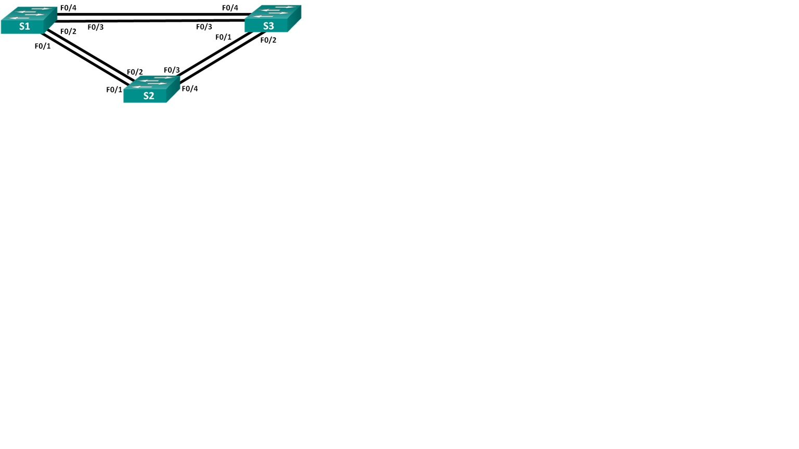
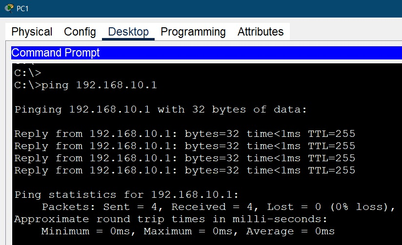
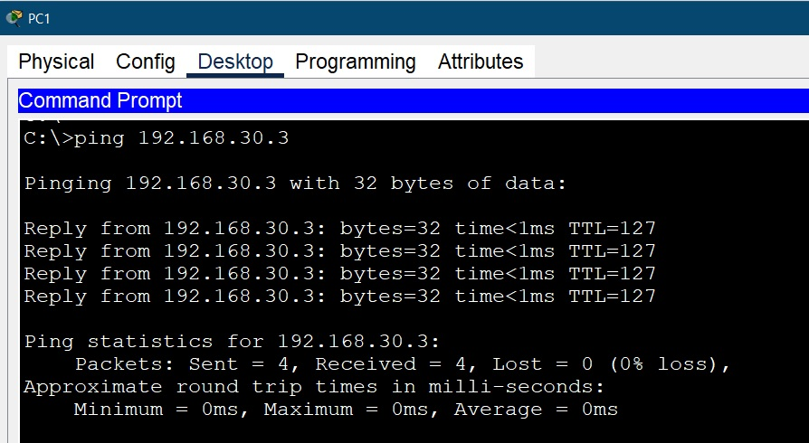
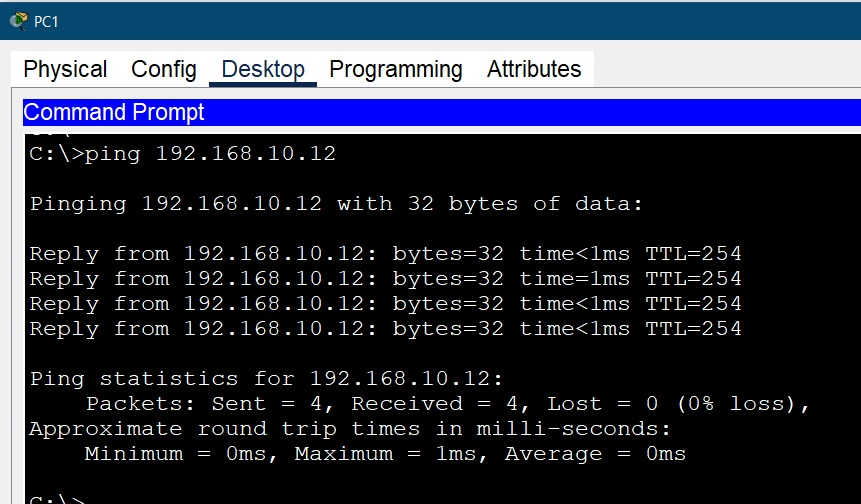
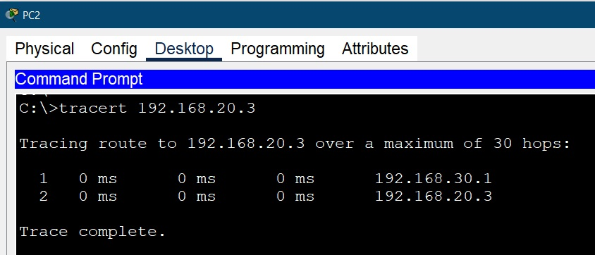

**_Лабораторная работа №07._**

*Развертывание коммутируемой сети с резервными каналами*

ТОПОЛОГИЯ

Таблица алресации
                    
Устройство| Интерфейс |    IPv4 адресс     |  Маска подсети   |
----------| --------- |--------------------|------------------|
S1        |   VLAN1   |   192.168.1.1      |  255.255.255.0   |
S1        |   VLAN1   |   192.168.1.2      |  255.255.255.0   |
S1        |   VLAN1   |   192.168.1.3      |  255.255.255.0   |
-------------------------------------------------------------

# Задачи
    Часть 1. Создание сети и настройка основных параметров устройства
    Часть 2. Выбор корневого моста
    Часть 3. Наблюдение за процессом выбора протоколом STP порта, исходя из стоимости портов
    Часть 4. Наблюдение за процессом выбора протоколом STP порта, исходя из приоритета портов

-----------------------------------------------------

# Часть 1. Настройка основных параметров устройств

1.1 - 1.4 Создали сеть согласно топологии
Базовая настройка роутера и коммутаторов на основве файла настроек.
Рекомендуется делать на окончательном этапе, чтобы часто не вводить пароли
Поменять: 

    hostname & ip domain-name 
соответствующие тому оборудованию на котором будет накатываться конфигурация

перед копированием и вставкой
Зайти в режим глобальной конфигурации

(config)# 

    service password-encryption
    !
    hostname S2
    !
    enable secret 5 $1$mERr$9cTjUIEqNGurQiFU.ZeCi1
    !
    no ip domain-lookup
    ip domain-name S2
    !
    username admin secret 5 $1$mERr$hx5rVt7rPNoS4wqbXKX7m0
    !
    banner motd # Unauthorized access is prohibited! #
    !
    line con 0
    password 7 0822455D0A16
    login
    exec-timeout 5 0
    !
    line vty 0 4
    exec-timeout 5 0
    password 7 0822455D0A16
    login local
    transport input ssh
    line vty 5 15
    exec-timeout 5 0
    password 7 0822455D0A16
    login local
    transport input ssh
    !
    end

Выполнить комманды

    (config)# crypto key generate rsa general-keys modulus 1024
    (config)# ip ssh version 2
    #w
    #reload
Генерация ssh-ключа на основе локальных данных конфигурации, переключение на новую версию ssh, сохранение и перезагрузка обррудования.

# Часть 2. Создание сетей VLAN и назначение портов коммутатора
2.1 Создаем сети VLAN на коммутаторах.

    vlan 10
    name Management
    vlan 20
    name Sales
    vlan 30 
    name Operation
    vlan 999 
    name Native
    vlan 1000
    name Parking
    
    interface range F0/2-5, F0/7-24          (для S1) или
    interface range F0/2-17, F0/19-24, G0/2  (для S2)
    switchport mode access 
    switchport access vlan 1000

2.2. Назначим сети VLAN соответствующим интерфейсам коммутатора.
    
    interface F0/6                           (для S1) или
    interface F0/18                          (для S2)
    switchport mode access 
    switchport access vlan 20                (для S1) или
    switchport access vlan 30                (для S2) 

# Часть 3. Конфигурация магистрального канала стандарта 802.1Q между коммутаторами

3.1 Вручную настроим магистральный интерфейс на коммутаторах S1 и S2.

    interface g0/1
    switchport mode trunk
    switchport trunk native vlam 999
    switchport trunk allowed vlan 10,20,30,999
    switchport nonegotiate 

Последней коммандой отключаем DTP

Проверка

    sh vlan brief 
    sh interfaces trunk   

    
3.2. Вручную настроим магистральный интерфейс G0/2 на коммутаторе S1 
     
    interface GigabitEthernet0/2
    switchport mode trunk
    switchport trunk native vlan 999
---------------------------------------------------
    Вопрос: Что произойдет, если G0/0/1 на R1 будет отключен?
    Ответ: Симуляция показала, что т.к. пакеты идут через R1, то сеть перестанет работать.

# Часть 4. Настройка маршрутизации между сетями VLAN

4.1. Настройте маршрутизатор.

Настраиваем подинтерфесы для VLAN

    interface GigabitEthernet0/0/1.10
    description Management
    encapsulation dot1Q 10
    ip address 192.168.10.1 255.255.255.0
    
    interface GigabitEthernet0/0/1.20
    description Sales
    encapsulation dot1Q 20
    ip address 192.168.20.1 255.255.255.0

    interface GigabitEthernet0/0/1.30
    description Operations
    encapsulation dot1Q 30
    ip address 192.168.30.1 255.255.255.0

    interface GigabitEthernet0/0/1.999
    encapsulation dot1Q 999 native

# Часть 5. Проверbv, работает ли маршрутизация между VLAN

5.1. Выполните следующие тесты с PC1. Все должно быть успешно.

5.2. Выполним с PC2 комманту: tracert 192.168.20.3

Файл схемы сети [здесь](Lab_06/lab_06.pkt).

- [Вернуться на основную страницу ](..readme.md)

