**_Лабораторная работа №08._**

*Реализация DHCPv4*

ТОПОЛОГИЯ

Таблица алресации
                    
Устройство| Интерфейс |    IPv4 адресс     |  Маска подсети   |
----------| --------- |--------------------|------------------|
S1        |   VLAN1   |   192.168.1.1      |  255.255.255.0   |
S1        |   VLAN1   |   192.168.1.2      |  255.255.255.0   |
S1        |   VLAN1   |   192.168.1.3      |  255.255.255.0   |
-------------------------------------------------------------

# Задачи
    Часть 1. Создание сети и настройка основных параметров устройства
    Часть 2. Выбор корневого моста
    Часть 3. Наблюдение за процессом выбора протоколом STP порта, исходя из стоимости портов
    Часть 4. Наблюдение за процессом выбора протоколом STP порта, исходя из приоритета портов

-----------------------------------------------------

# Часть 1. Настройка основных параметров устройств

1.1 - 1.3 Создали сеть согласно топологии
Базовая настройка роутера и коммутаторов на основве файла настроек.
Рекомендуется делать на окончательном этапе, чтобы часто не вводить пароли
Поменять: 

    hostname & ip domain-name 
соответствующие тому оборудованию на котором будет накатываться конфигурация

перед копированием и вставкой
Зайти в режим глобальной конфигурации

(config)# 

    service password-encryption
    !
    hostname S2
    !
    enable secret 5 $1$mERr$9cTjUIEqNGurQiFU.ZeCi1
    !
    no ip domain-lookup
    ip domain-name S2
    !
    username admin secret 5 $1$mERr$hx5rVt7rPNoS4wqbXKX7m0
    !
    banner motd # Unauthorized access is prohibited! #
    !
    line con 0
     password 7 0822455D0A16
     login
     exec-timeout 5 0
     logging synchronous
    !
    line vty 0 4
     exec-timeout 5 0
     password 7 0822455D0A16
     login local
     transport input ssh
    line vty 5 15
     exec-timeout 5 0
     password 7 0822455D0A16
     login local
     transport input ssh
    !
    end

Выполнить комманды

    (config)# crypto key generate rsa general-keys modulus 1024
    (config)# ip ssh version 2
    #w
    #reload
Генерация ssh-ключа на основе локальных данных конфигурации, переключение на новую версию ssh, сохранение и перезагрузка обррудования.

1.4. Проверка связи.

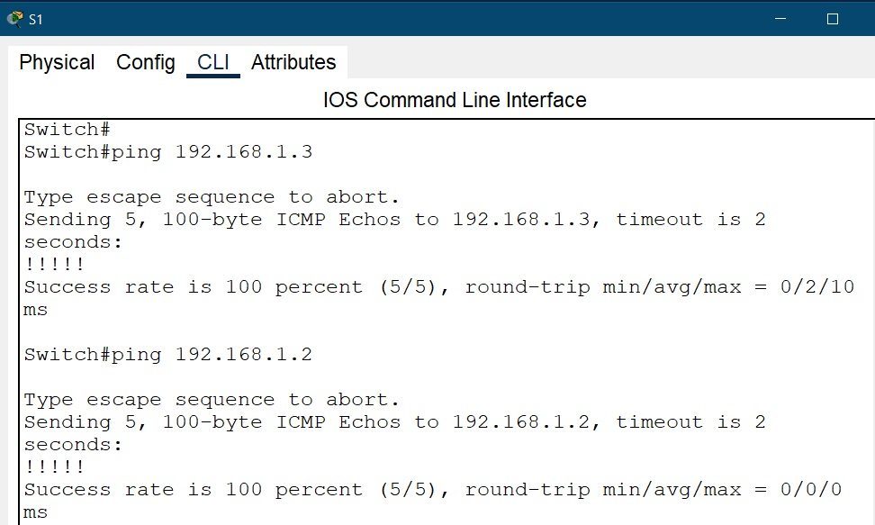
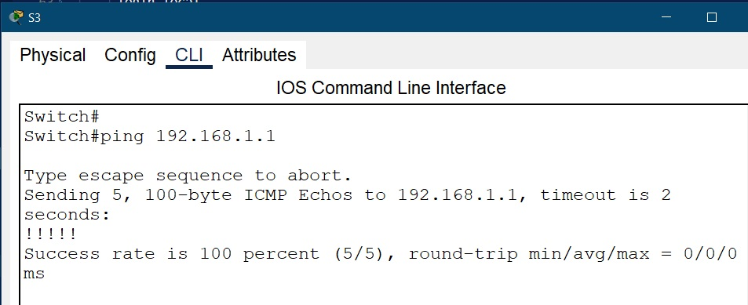

(УСПЕШНО)

# Часть 2:	Определение корневого моста

2.1 - 2.3 Проводим настройку согласно задания

    interface range F0/1-24, G0/1-2
    shutdown
    interface range F0/1-4
    switchport mode trunk
    interface range F0/2, F0/4
    no shutdown
    

2.4. Просматриваем данные STP
    
    show spanning-tree 
    
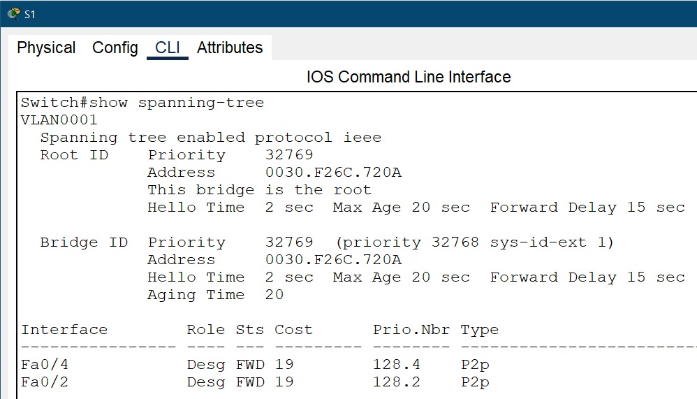
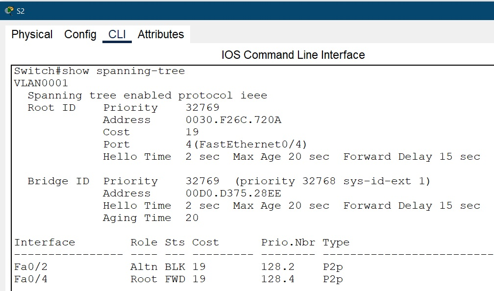
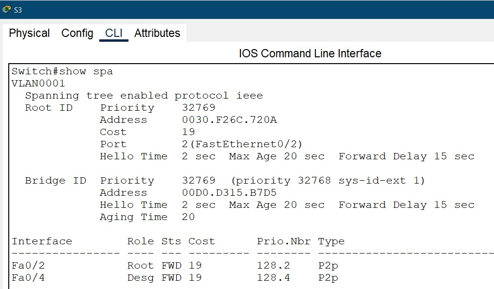

Запишем роль и состояние (Sts) активных портов на каждом коммутаторе в топологии.
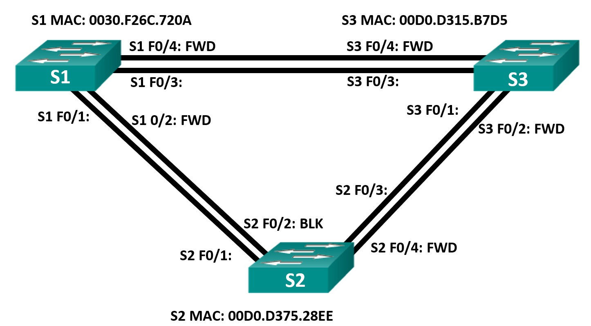

С учетом выходных данных, поступающих с коммутаторов, ответим на следующие вопросы:

    Какой коммутатор является корневым мостом? 
    - S1

    Почему этот коммутатор был выбран протоколом spanning-tree в качестве корневого моста? 
    - У него наименьший BID (= BP (одинаковы у всех)+ MAC (наименьший у S1))

    Какие порты на коммутаторе являются корневыми портами? 
    - Те порты которые идут к корневому SWITCH, может быть только 1 на не корневом устройстве

    Какие порты на коммутаторе являются назначенными портами? 
    - Все порты кроме коневого порта

    Какой порт отображается в качестве альтернативного и в настоящее время заблокирован? 
    - S2: Fa0/2

    Почему протокол spanning-tree выбрал этот порт в качестве невыделенного (заблокированного) порта?
    - Выбрана линия с наибольшей стоимостью прохождения т.к. это линия между 2 и 3 коммутаторами и она единственная включена на текущйи момент, то это единственный вариант, а т.к. у S2 наибольшая сумма приоритета и номера порта то выбор на нем

# Часть 3:	Наблюдение за процессом выбора протоколом STP порта, исходя из стоимости портов

3.1 - 3.3. Вручную настроим магистральный интерфейс на коммутаторах S1 и S2.

    interface fastEthernet 0/4          - выбранный интерфейс должен быть включенным
    spanning-tree vlan 1 cost 18
    
    show spanning-tree

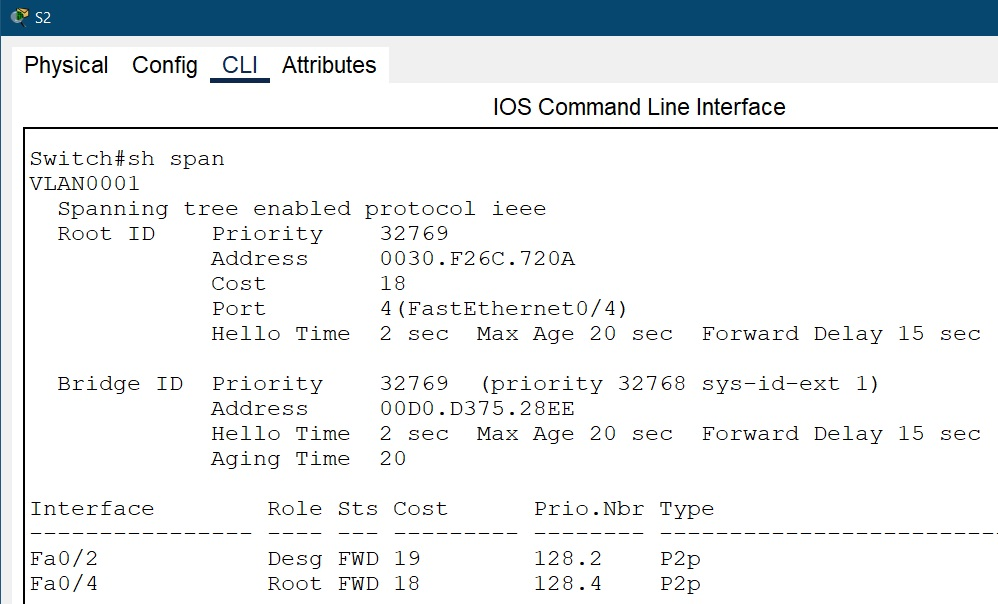
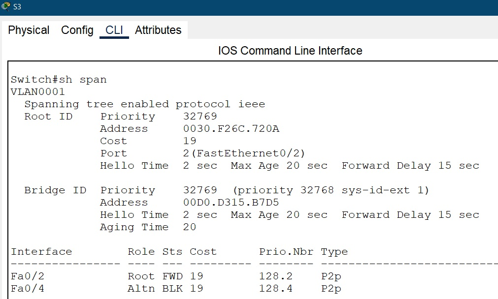

!! Видим что при изменении стоимости прохождения изменился порт блокировки с S2 на S3

    Вопрос: Почему протокол spanning-tree заменяет ранее заблокированный порт на назначенный порт и блокирует порт, который был назначенным портом на другом коммутаторе?
    - Видим что при уменьшении стоимости прохождения изменился порт блокировки с S2 на S3 (при равных выбор будет за коммуттором с меньшим приоритетом + номер порта)

3.4. Удалим изменения стоимости порта

    interface fastEthernet 0/4
    spanning-tree vlan 1 cost 18
    
    show spanning-tree

Увидим что картина состояния STP вернулась к педыдущей.

# Часть 4:	Наблюдаем за процессом выбора протоколом STP порта, исходя из приоритета портов

4.1. Включим порты F0/1 и F0/3 на всех коммутаторах

    interface range F0/1-24, G0/1-2
    no shutdown

    show spanning-tree
    
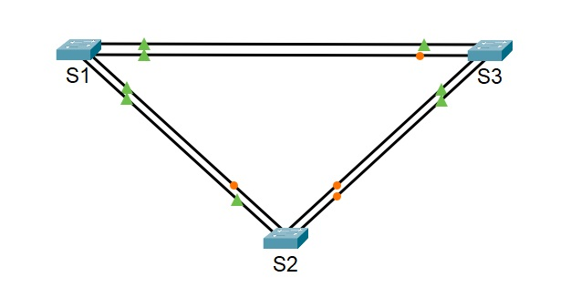
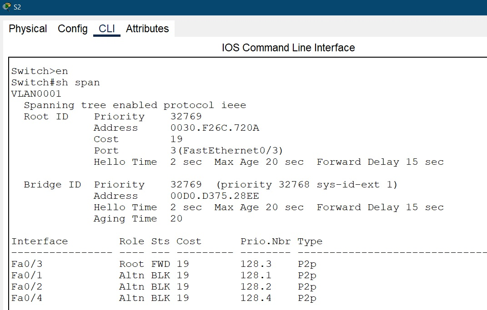
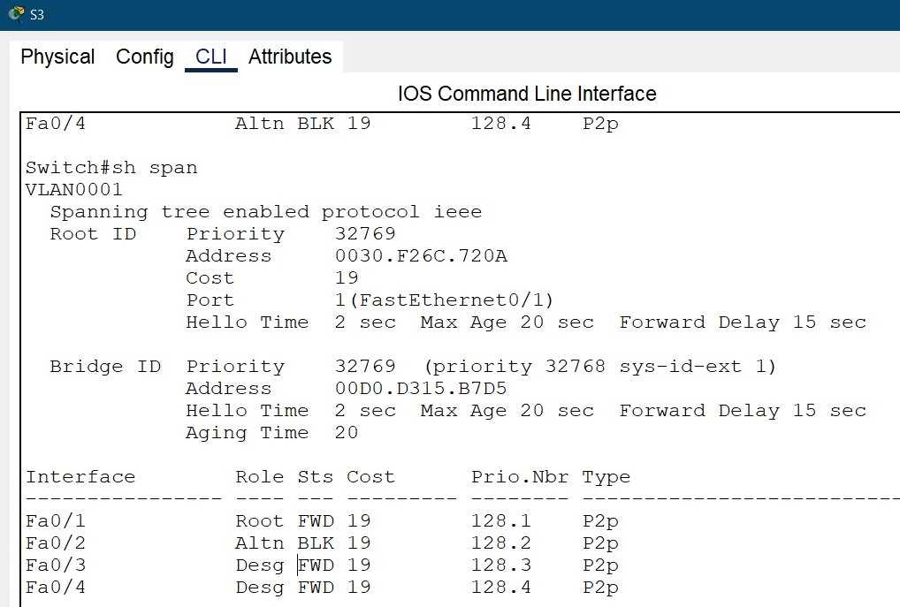

Вопросы:

    Какой порт выбран протоколом STP в качестве порта корневого моста на каждом коммутаторе некорневого моста? 
    - S2: f0/3 & S3: f/01
    Почему протокол STP выбрал эти порты в качестве портов корневого моста на этих коммутаторах?
    - Потому что при сопоставлении суммы номера порта и приоритета оказались не впользу портов S2 в отличие от S3,  где они оказались меньше

Вопросы для повторения

    1.	Какое значение протокол STP использует первым после выбора корневого моста, чтобы определить выбор порта?
    - Root Path Cost - стоимосит маршрута
    2.	Если первое значение на двух портах одинаково, какое следующее значение будет использовать протокол STP при выборе порта?
    - выбирается меньший порт
    3.	Если оба значения на двух портах равны, каким будет следующее значение, которое использует протокол STP при выборе порта?
    - дажее выбираюься Designated порты  т.к. у корнеого порта все порты Designated то блокируются порты на не корневом коммутаторе

Файл схемы сети [здесь](Lab_07/lab_07.pkt).

- [Вернуться на основную страницу ](..readme.md)

