**_Лабораторная работа №09._**

*Конфигурация безопасности коммутатора*

ТОПОЛОГИЯ

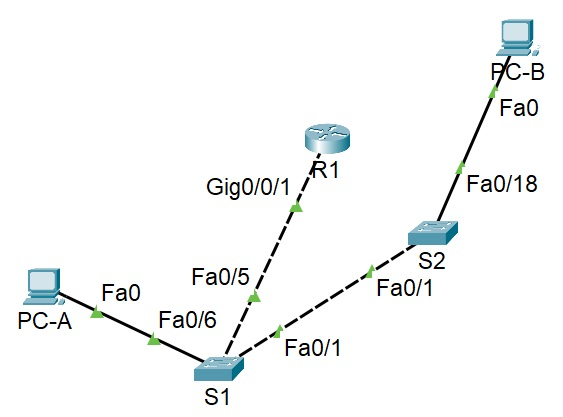
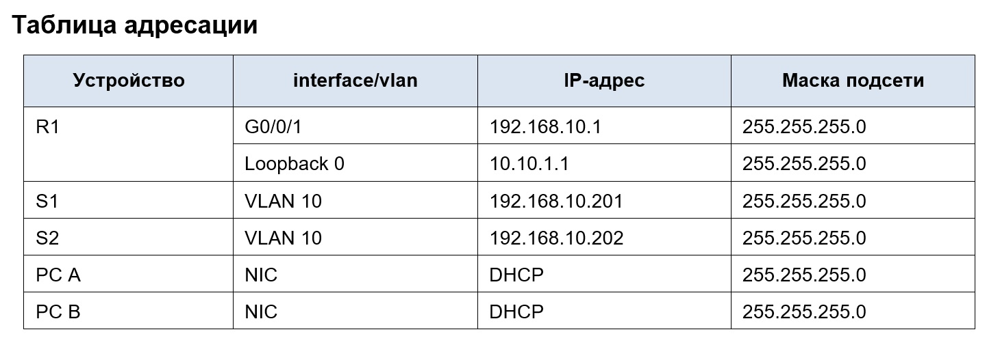

# Цели
    Часть 1. Настройка основного сетевого устройства
    •	Создайте сеть.
    •	Настройте маршрутизатор R1.
    •	Настройка и проверка основных параметров коммутатора
    Часть 2. Настройка сетей VLAN
    •	Сконфигруриуйте VLAN 10.
    •	Сконфигруриуйте SVI для VLAN 10.
    •	Настройте VLAN 333 с именем Native на S1 и S2.
    •	Настройте VLAN 999 с именем ParkingLot на S1 и S2.
    Часть 3: Настройки безопасности коммутатора.
    •	Реализация магистральных соединений 802.1Q.
    •	Настройка портов доступа
    •	Безопасность неиспользуемых портов коммутатора
    •	Документирование и реализация функций безопасности порта.
    •	Реализовать безопасность DHCP snooping .
    •	Реализация PortFast и BPDU Guard
    •	Проверка сквозной связанности.

Примечание: вместо указанного в задании роутера Cisco 4221 (отсутствует в оборудовании) использован Cisco 4231
-----------------------------------------------------

# Часть 1. Настройка основного сетевого устройства

1.1 - 1.2 Создали и настройка сети согласно топологии
Базовая настройка роутера и коммутаторов на основве файла настроек.

    enable
    configure terminal
    hostname R1
    no ip domain lookup
    ip dhcp excluded-address 192.168.10.1 192.168.10.9
    ip dhcp excluded-address 192.168.10.201 192.168.10.202
    ip dhcp relay information trust-all
    !
    ip dhcp pool Students
    network 192.168.10.0 255.255.255.0
    default-router 192.168.10.1
    domain-name CCNA2.Lab-11.6.1
    !
    interface Loopback0
    ip address 10.10.1.1 255.255.255.0
    !
    interface GigabitEthernet0/0/1
    description Link to S1
    ip address 192.168.10.1 255.255.255.0
    no shutdown
    !
    line con 0
    logging synchronous
    exec-timeout 0 0
Загружена текущая конфигурация на R1 и проведена успешная проверка, согласно задания.
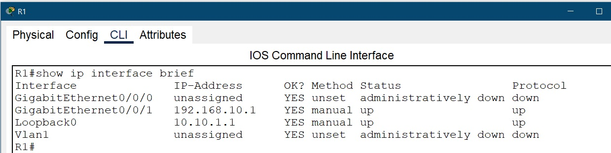

1.3. Настройка и проверка основных параметров коммутатора
Настройка коммутаторов S1 & S2 (соответственно)

    S1
    Switch(config)#hostname S1
    S1(config)#no ip domain-name 
    S1(config)#ip default-gateway 192.168.10.1
    S1(config)#interface f0/6                       (для S2 только f0/18)
    S1(config-if)#switchport mode access
    S1(config-if)#switchport access vlan 10
    S1(config)#interface vlan 10
    S1(config-if)#ip address 192.168.10.201 255.255.255.0
    S1(config)#vlan 10
    S1(config-vlan)#name Management
    S1(config)#vlan 333
    S1(config-vlan)#name Native
    S1(config)#vlan 999
    S1(config-vlan)#name ParkingLot
    S1(config)#interface f0/5, f0/1                 (для S2 только f0/1)
    S1(config-if)#switchport mode trunk 
    S1(config-if)#switchport trunk native vlan 333
    S1(config-if)#switchport trunk allowed vlan 10,333,999
    S1(config)#interface f0/1
    S1(config-if)#switchport nonegotiate 
        S1(config)#interface range f0/2-4,f0/7-24,g0/1-2
        S1(config-if-range)#switchport mode access 
        S1(config-if-range)#switchport access vlan 999
        S1(config-if-range)#shutdown 

    S2  (измененная часть для S2 - выключение неиспользуемых интерфейсов)
        S2(config)#interface range f0/2-17, f0/19-24, g0/1-2
        S2(config-if-range)#switchport mode access 
        S2(config-if-range)#switchport access vlan 999
        S2(config-if-range)#shutdown 

# Часть 2. Настройка сетей VLAN
2.1 - 2.4. Создаем и настраиваем сети VLAN на коммутаторах.

Настройка приведена в части 1й (выше)

# Часть 3. Настройки безопасности коммутатора.

3.1 Релизация магистральных соединений 802.1Q

    R1(config)#interface g0/0/1.10
    R1(config-subif)#encapsulation dot1Q 10
    R1(config-subif)#ip address 192.168.10.1 255.255.255.0
    R1(config)#interface g0/0/1.333
    R1(config-subif)#encapsulation dot1Q 333 native 

Настройка портов на S1 & S2 в режимах транкинга приведена в п. 1.3.
Комманда для проверки трануинговых соединений и ответ на нее соответствуют уазанной в инструкции для обоих коммутаторов
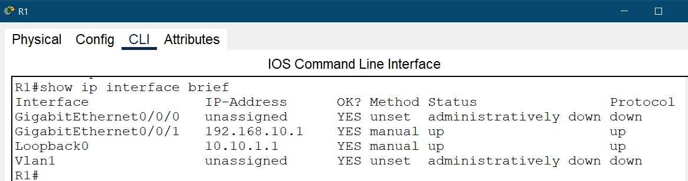

3.2. - 3.3. Настройка портов доступа для S1 & S2 и безопасность неиспользуемых портов коммутатора

Настройка приведена в п.1.3.
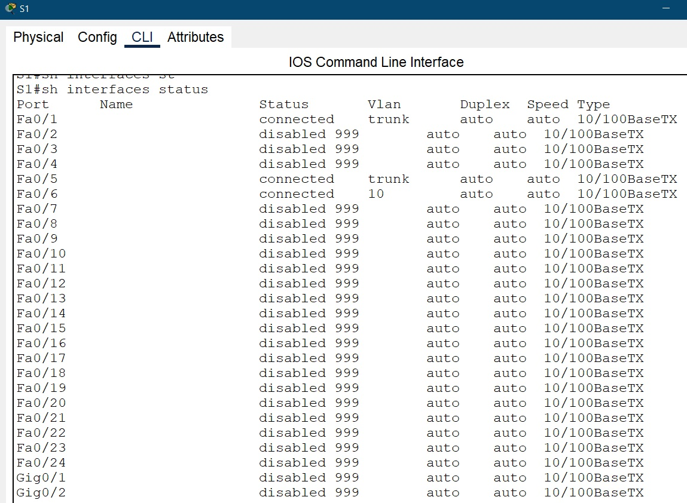
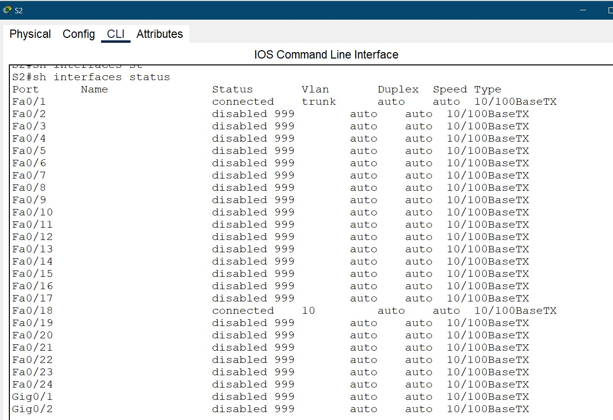
    
3.4. Документирование и реализация функций безопасности порта

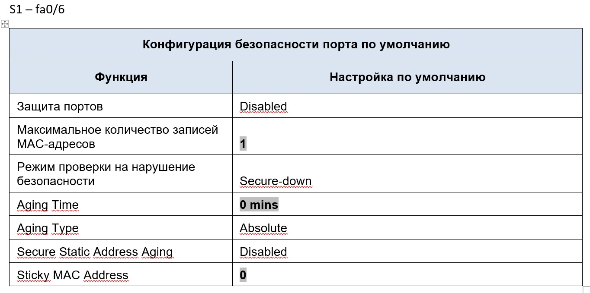

или

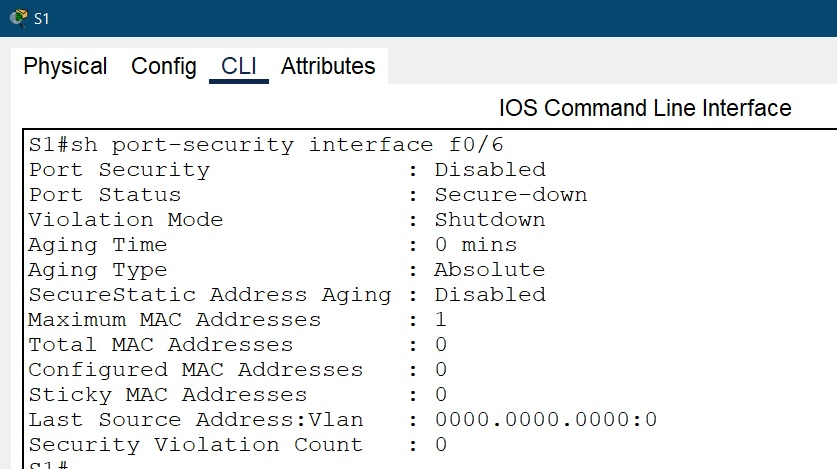

проводим указанные настройки

    S1(config)#interface f0/6
    S1(config-if)#switchport port-security 
    S1(config-if)#switchport port-security maximum 3
    S1(config-if)#switchport port-security violation restrict 
    S1(config-if)#switchport port-security aging time 60
    Aging Type : Inactivity - не настраивается нет команды

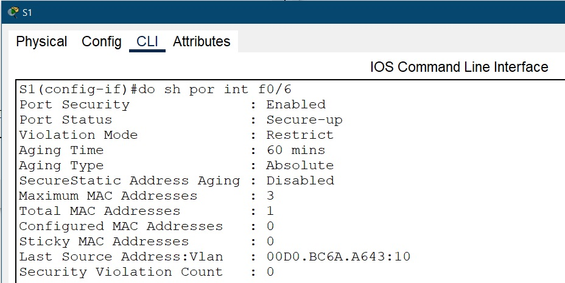
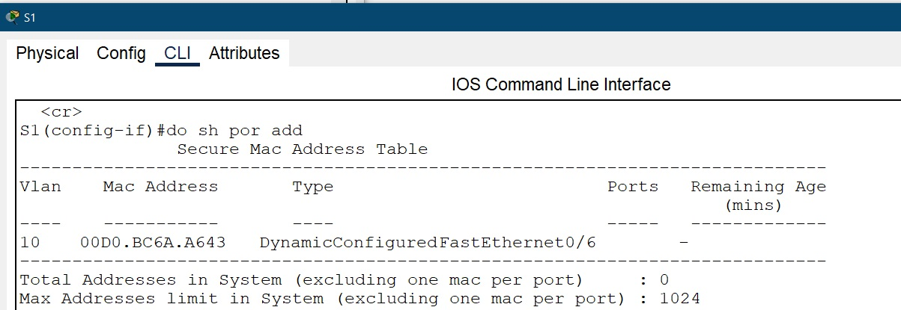

Теперь настраиваем безопасность для S2 - f0/18

    S2(config)#interface f0/18
    S2(config-if)#switchport port-security 
    S2(config-if)#switchport port-security maximum 2
    S2(config-if)#switchport port-security violation protect 
    S2(config-if)#switchport port-security aging time 60
    Aging Type : Inactivity - не настраивается нет команды

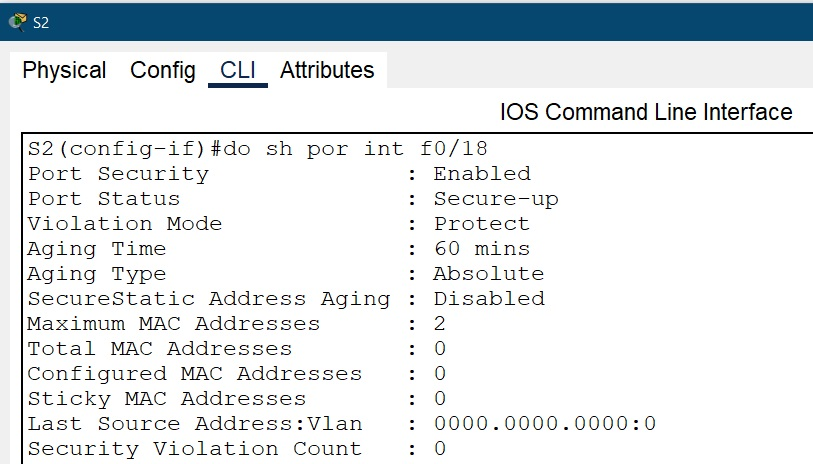
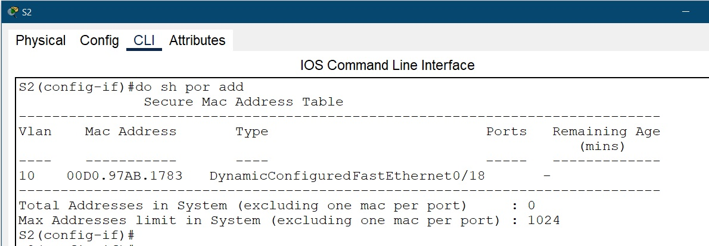

3.5. Реализовываем безопасность DHCP snooping

    S1(config)#ip dhcp snooping
    S1(config)#ip dhcp snooping vlan 10
    S1(config)#interface fastEthernet 0/1
    S1(config-if)#ip dhcp snooping trust 
    S1(config)#interface fastEthernet 0/6
    S1(config-if)#ip dhcp snooping limit rate 5

    S2(config)#ip dhcp snooping
    S2(config)#ip dhcp snooping vlan 10
    S2(config)#interface f0/1
    S2(config-if)#ip dhcp snooping trust 
    S2(config)#interface f0/18
    S2(config-if)#ip dhcp snooping limit rate 6

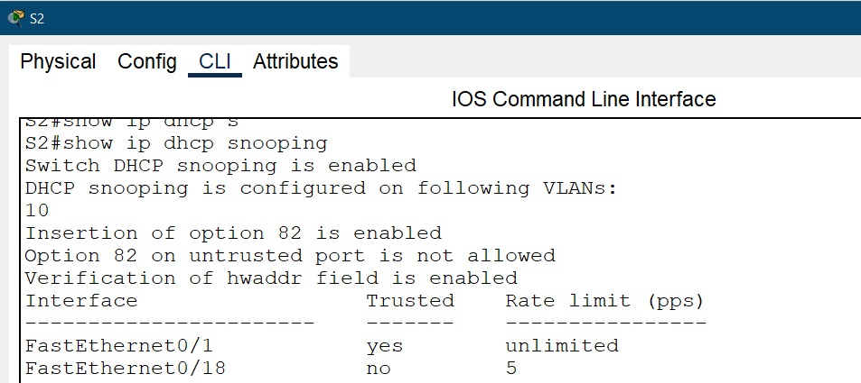
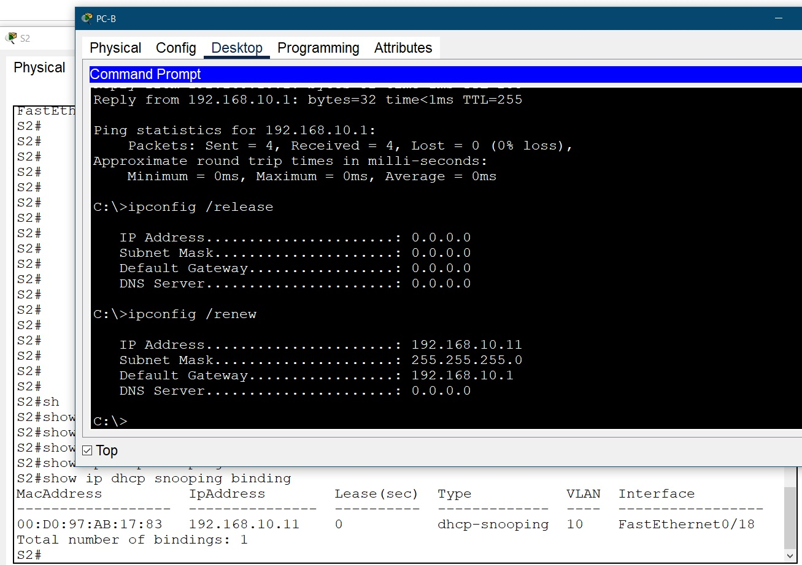

3.6. Реализация PortFast и BPDU Guard на портах для оконечных устройств

    S1(config)#interface f0/6
    S1(config-if)#spanning-tree portfast 
    S1(config-if)#spanning-tree bpduguard enable

    S2(config)#interface f0/18
    S2(config-if)#spanning-tree portfast 
    S2(config-if)#spanning-tree bpduguard enable

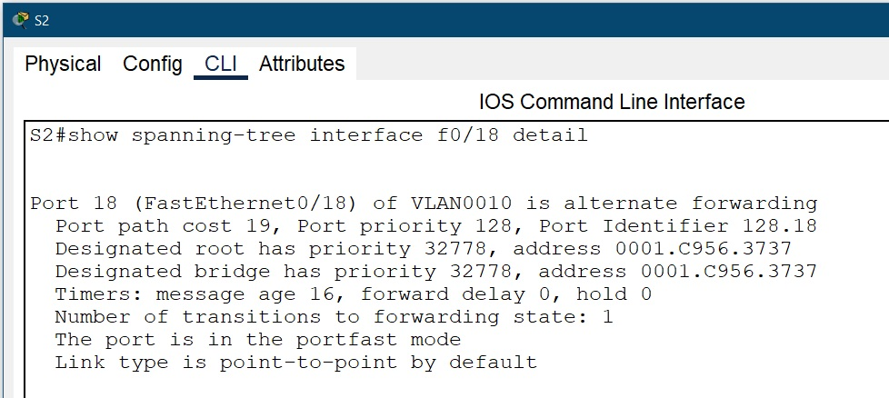

3.7. Пинги все проходят.

Вопросы для повторения:

    1.	С точки зрения безопасности порта на S2, почему нет значения таймера для оставшегося возраста в минутах, когда было сконфигурировано динамическое обучение - sticky?
    Ответ: Неправильный вопрос. Но насколько я понимаю его смысл - то при динамической настройке адреса сами удаляются по истечению времени, а при настройке sticky mac-адрес вносятся в таблицу маршрутизации вручную и удалить их можно тоже вручную поэтому таймер времени уже не имеет смысла.

    2.	Что касается безопасности порта на S2, если вы загружаете скрипт текущей конфигурации на S2, почему порту 18 на PC-B никогда не получит IP-адрес через DHCP?
    Ответ: Мы в ходе работы не вносили скрипт настроек на S2 только на R1, пдозреваю вопрос в этом - скорее всего не будет работать т.к. собьются настройки "роутера на палочке"

    3.	Что касается безопасности порта, в чем разница между типом абсолютного устаревания и типом устаревание по неактивности?
    Ответ: Разница в том чт опри абсолютном устаревании mac-адреса удаляются по истечению указанного времени, а по таймеру неактивности только если эти адреса не отвечают указанное время т.е. если ПК включен весь день то он не будет удаляться из иаблицы адресов и только при его выключении, скажем в конце рабочего дня, до утра если время неактивности не перекрывает время выключения адрес будет удален.

Файл схемы сети [здесь](Lab_09/lab_09.pkt).

- [Вернуться на основную страницу ](/readme.md)

