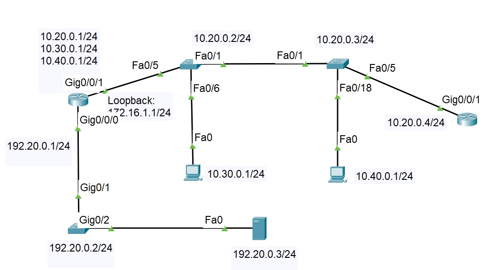
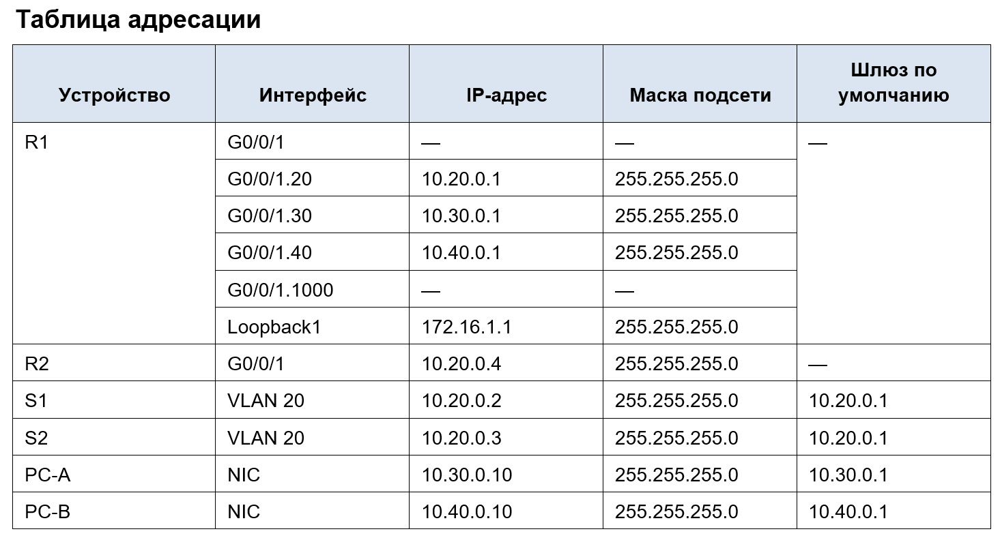
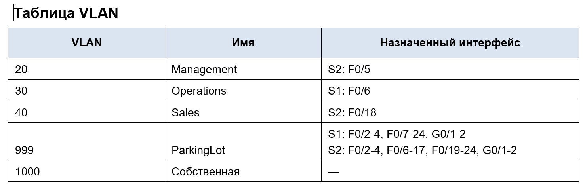
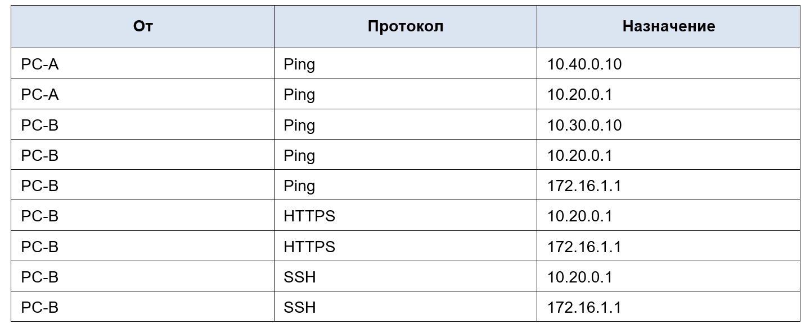
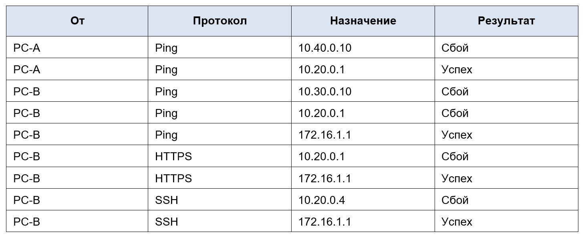

**_Лабораторная работа №11._**

*Настройка и проверка расширенных списков контроля доступа*

ТОПОЛОГИЯ

# Цели
    Часть 1. Создание сети и настройка основных параметров устройства
    Часть 2. Настройка сетей VLAN на коммутаторах.
    Часть 3. Настройте транки (магистральные каналы).
    Часть 4. Настройте маршрутизацию.
    Часть 5. Настройте удаленный доступ
    Часть 6. Проверка подключения
    Часть 7. Настройка и проверка списков контроля доступа (ACL)

ВАЖНО: Native VLAN 666
-----------------------------------------------------

# Часть 1. Создание сети и настройка основных параметров устройства

1.1 - 1.3 Создали и настройка сети согласно топологии
Базовая настройка роутера и коммутаторов на основве файла настроек.

Меняем при внесении конфигурации только имя хоста оборудования согласно схемы: R!, R2, S1, S2

    !
    service password-encryption
    !
    hostname S1
    !
    enable secret 5 $1$mERr$9cTjUIEqNGurQiFU.ZeCi1
    !
    banner motd ^C
    *******************************************************
    ****     Caution! Enter only adminstrator OTUS     ****
    *******************************************************^C
    !
    line con 0
    password 7 0822455D0A16
    logging synchronous
    login
    !
    line aux 0
    login
    !
    line vty 0 4
    password 7 0822455D0A16
    logging synchronous
    login
    line vty 5 15
    password 7 0822455D0A16
    logging synchronous
    login
    !
    end

 и сохраняем конфигурацию

    copy running-config startup-config 
    или
    write memory

# Часть 2. ННастройка сетей VLAN на коммутаторах.

2.1 - 2.2 Создание и настройка VLAN согласно задачи

    S1#show vlan brief 

    VLAN Name                             Status    Ports
    ---- -------------------------------- --------- -------------------------------
    1    default                          active    
    20   Managment                        active    
    30   Operations                       active    Fa0/6
    40   Sales                            active    
    666  NATIVE                           active    
    999  ParkingLot                       active    Fa0/2, Fa0/3, Fa0/4, Fa0/7
                                                    Fa0/8, Fa0/9, Fa0/10, Fa0/11
                                                    Fa0/12, Fa0/13, Fa0/14, Fa0/15
                                                    Fa0/16, Fa0/17, Fa0/18, Fa0/19
                                                    Fa0/20, Fa0/21, Fa0/22, Fa0/23
                                                    Fa0/24, Gig0/1, Gig0/2
    1000 MySelf                           active    
    1002 fddi-default                     active    
    1003 token-ring-default               active    
    1004 fddinet-default                  active    
    1005 trnet-default                    active    
    S1#

    S2#show vlan brief 

    VLAN Name                             Status    Ports
    ---- -------------------------------- --------- -------------------------------
    1    default                          active    
    20   Managment                        active    Fa0/5
    30   Operations                       active    
    40   Sales                            active    Fa0/18
    666  NATIVE                           active    
    999  ParkingLot                       active    Fa0/2, Fa0/3, Fa0/4, Fa0/6
                                                    Fa0/7, Fa0/8, Fa0/9, Fa0/10
                                                    Fa0/11, Fa0/12, Fa0/13, Fa0/14
                                                    Fa0/15, Fa0/16, Fa0/17, Fa0/19
                                                    Fa0/20, Fa0/21, Fa0/22, Fa0/23
                                                    Fa0/24, Gig0/1, Gig0/2
    1000 MySelf                           active    
    1002 fddi-default                     active    
    1003 token-ring-default               active    
    1004 fddinet-default                  active    
    1005 trnet-default                    active    
    S2#

# Часть 3. Настройте транки (магистральные каналы)

3.1 - 3.2 Настраиваем магистральные транки на S1 и S2 согласно задания, результат:

    S2#show interfaces trunk 
    Port        Mode         Encapsulation  Status        Native vlan
    Fa0/1       on           802.1q         trunking      666

    Port        Vlans allowed on trunk
    Fa0/1       20,30,40,666

    Port        Vlans allowed and active in management domain
    Fa0/1       20,30,40,666

    Port        Vlans in spanning tree forwarding state and not pruned
    Fa0/1       20,30,40,666

    S1# show interfaces trunk 
    Port        Mode         Encapsulation  Status        Native vlan
    Fa0/1       on           802.1q         trunking      666
    Fa0/5       on           802.1q         trunking      666

    Port        Vlans allowed on trunk
    Fa0/1       20,30,40,666
    Fa0/5       20,30,40,666

    Port        Vlans allowed and active in management domain
    Fa0/1       20,30,40,666
    Fa0/5       20,30,40,666

    Port        Vlans in spanning tree forwarding state and not pruned
    Fa0/1       20,30,40,666
    Fa0/5       20,30,40,666

# Часть 4. Настроим маршрутизацию

4.1 - 4.2 Настраиваем интерфейсы на R1 и R2 согласно задания, результат:

    R1#show ip interface brief 
    Interface              IP-Address      OK? Method Status                Protocol 
    GigabitEthernet0/0/0   192.20.0.1      YES manual up                    up 
    GigabitEthernet0/0/1   unassigned      YES NVRAM  up                    up 
    GigabitEthernet0/0/1.2010.20.0.1       YES manual up                    up 
    GigabitEthernet0/0/1.3010.30.0.1       YES manual up                    up 
    GigabitEthernet0/0/1.4010.40.0.1       YES manual up                    up 
    GigabitEthernet0/0/1.666unassigned      YES unset  up                    up 
    GigabitEthernet0/0/2   unassigned      YES NVRAM  administratively down down 
    Loopback1              172.16.1.1      YES manual up                    up 
    Vlan1                  unassigned      YES unset  administratively down down

    R2#show ip interface brief 
    Interface              IP-Address      OK? Method Status                Protocol 
    GigabitEthernet0/0/0   unassigned      YES unset  administratively down down 
    GigabitEthernet0/0/1   10.20.0.4       YES manual up                    up 
    GigabitEthernet0/0/2   unassigned      YES unset  administratively down down 
    Vlan1                  unassigned      YES unset  administratively down down

# Часть 5. Настроим удаленный доступ.

5.1. Настроим все сетевые устройства для базовой поддержки SSH

Приводится пример для роутера R1 (для всех сетевых устройств аналогично)

                                Настройка инфтерфейса
    R1(config)# line vty 0 15
    R1(config-line)# password cisco
    R1(config-line)# login
    R1(config-line)# login local
    R1(config-line)# transport input ssh
    R1(config-line)# exec-timeout 5 0 
    R1(config-line)# exit

                                Настройка SSH и доступа
    R1(config)# no ip domain-lookup
    R1(config)# ip domain-name ccna-lab.com
    R1(config)# crypto key generate rsa general-keys modulus 1024
    R1(config)# ip ssh version 2
    R1(config)# username SSHadmin privilege 15 secret $cisco123!

5.2. Задания этого пункта 

    R1(config)# ip http secure-server 
    R1(config)# ip http authentication local
Не выполняются т.к. Cisco Packet Tracer их не поддерживает

# Часть 6. Проверка подключения.

6.1 - 6.2 По результатм работы проведена проверка согласно таблицы

Все этапы успешны. Для проверки работы HTTP за R1 подключен HTTP-сервер.

# Часть 7. Настройка и проверка списков контроля доступа (ACL)

Согласно задания внедрены списки доступа

    R1#show access-lists 
    Extended IP access list SALES_DENY_WEB
    4 permit icmp 10.40.0.0 0.0.0.255 10.40.0.0 0.0.0.255 (12 match(es))
    5 permit tcp any 172.16.1.0 0.0.0.255 (34 match(es))
    6 permit icmp any 172.16.1.0 0.0.0.255 (4 match(es))
    10 deny tcp 10.20.0.0 0.0.0.255 10.40.0.0 0.0.0.255 eq www

Для проверки их работы согласно таблицы 

проведены успешные тесты доступа. Для проверки работы HTTP за R1 подключен HTTP-сервер.

   
Файл схемы сети [здесь](Lab_11/lab_11.pkt).

- [Вернуться на основную страницу ](/readme.md)

