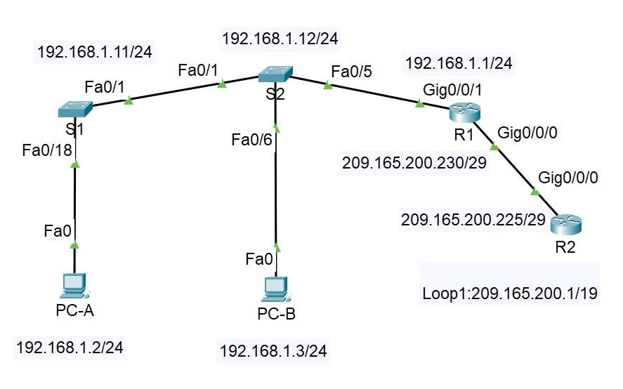
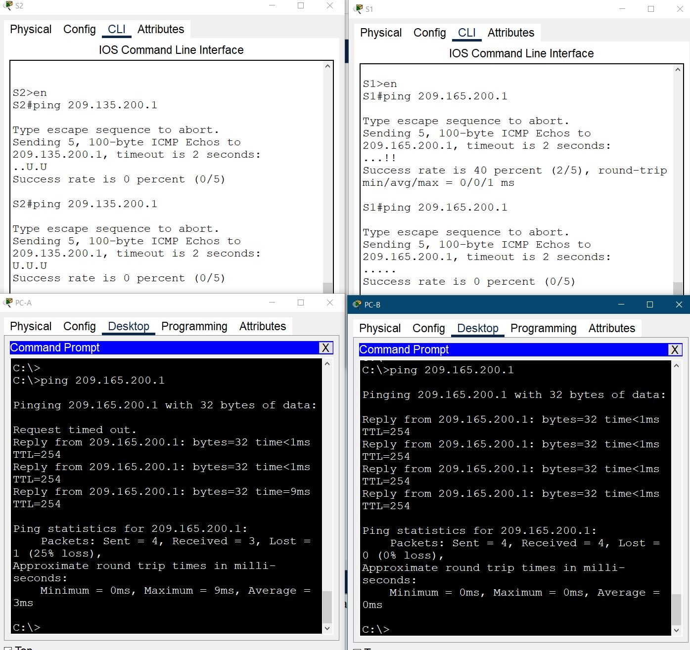
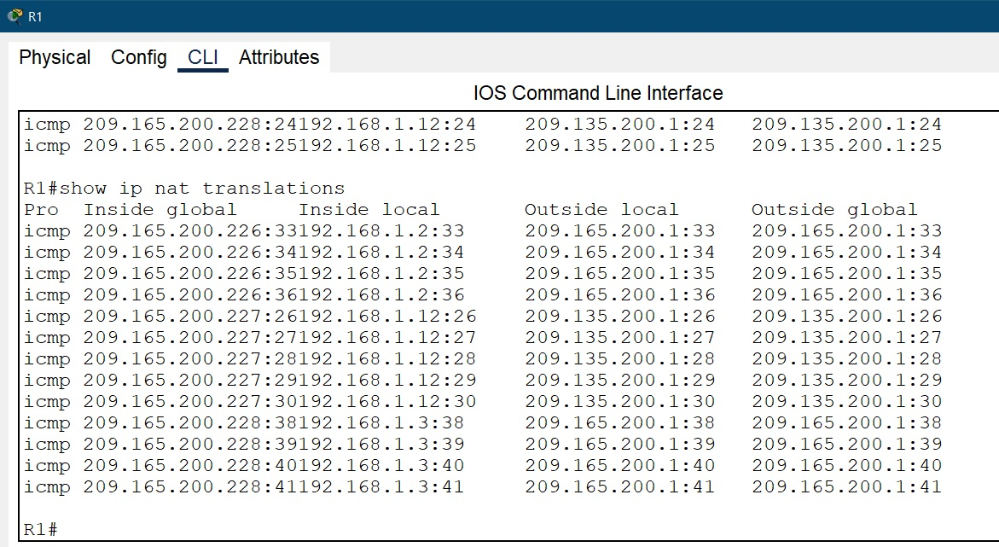
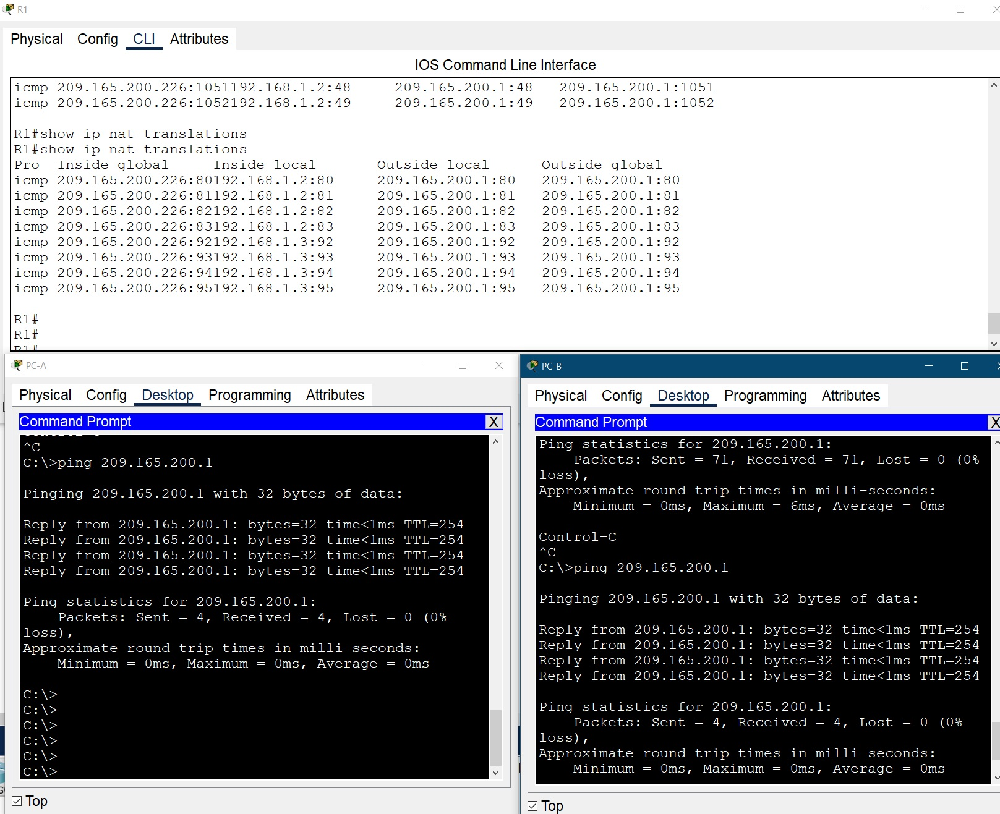
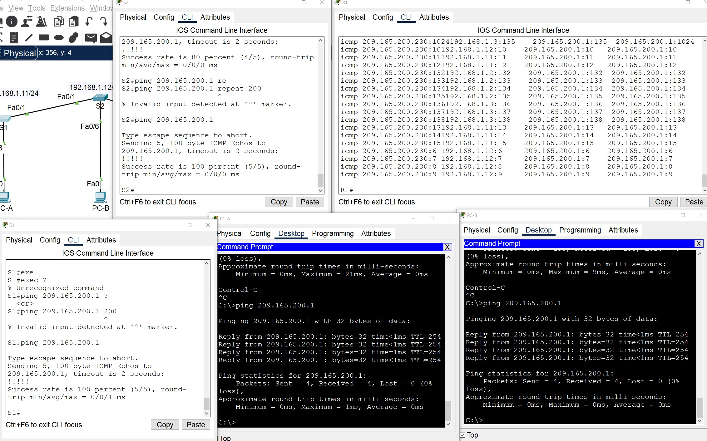
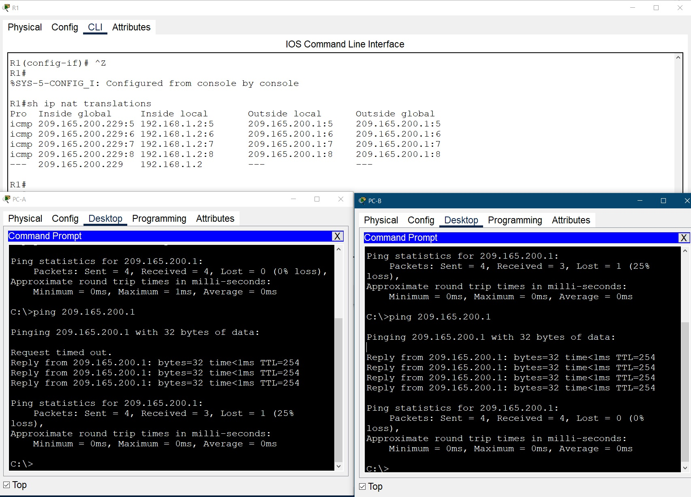

**_Лабораторная работа №12._**

*Настройка NAT для IPv4*

ТОПОЛОГИЯ

# Цели
    Часть 1. Создание сети и настройка основных параметров устройства
    Часть 2. Настройка и проверка NAT для IPv4
    Часть 3. Настройка и проверка PAT для IPv4
    Часть 4. Настройка и проверка статического NAT для IPv4.

-----------------------------------------------------

# Часть 1. Создание сети и настройка основных параметров устройства

1.1 - 1.3 Создали и настройка сети согласно топологии
Базовая настройка роутера и коммутаторов на основве файла настроек.

Меняем при внесении конфигурации только имя хоста оборудования согласно схемы: R!, R2, S1, S2

    !
    service password-encryption
    !
    hostname S1
    !
    enable secret 5 $1$mERr$9cTjUIEqNGurQiFU.ZeCi1
    !
    banner motd ^C
    *******************************************************
    ****     Caution! Enter only adminstrator OTUS     ****
    *******************************************************^C
    !
    line con 0
    password 7 0822455D0A16
    logging synchronous
    login
    !
    line aux 0
    login
    !
    line vty 0 4
    password 7 0822455D0A16
    logging synchronous
    login
    line vty 5 15
    password 7 0822455D0A16
    logging synchronous
    login
    !
    end

 и сохраняем конфигурацию

    copy running-config startup-config 
    или
    write memory

# Часть 2. Настройка и проверка NAT для IPv4.

2.1 Настройте NAT на R1, используя пул из трех адресов 209.165.200.226-209.165.200.228

    R1(config)#ip access-list standard forNAT192
    R1(config-std-nacl)#permit 192.168.1.0 0.0.0.255
    R1(config)#ip nat pool NAT192 209.165.200.226 209.165.200.228 netmask 255.255.255.248
    R1(config)#ip nat inside source list forNAT192 pool NAT192
    R1(config)#interface g 0/0/1
    R1(config-if)#ip nat inside 
    R1(config)#interface g 0/0/0
    R1(config-if)#ip nat outside 

2.2. Проверка конфигурации

A. Первоначально ping с PC_B не прошел - пробрасывем маршруты на роутерах:

    R1(config)#ip route 0.0.0.0 0.0.0.0 209.165.200.225
    R2(config)#ip route 192.168.1.0 255.255.255.0 209.165.200.230

после прохождения ping на Lo1 (209.165.200.1) смотрим таблицу NAT

    R1#show ip nat translations 
    Pro  Inside global          Inside local       Outside local      Outside global
    icmp 209.165.200.226:15     192.168.1.3:15     209.165.200.225:15 209.165.200.225:15
    icmp 209.165.200.226:16     192.168.1.3:16     209.165.200.225:16 209.165.200.225:16
    icmp 209.165.200.226:6      192.168.1.3:6      209.165.200.225:6  209.165.200.225:6

Вопрос: Во что был транслирован внутренний локальный адрес PC-B?

    209.165.200.225
 
Вопрос: Какой тип адреса NAT является переведенным адресом?

    Outside local

B. Дажее повторяем проверку с PC-A, после прохождения ping на Lo1 (209.165.200.1) смотрим таблицу NAT:

    R1#show ip nat translations 
    Pro  Inside global     Inside local       Outside local      Outside global
    icmp 209.165.200.226:10192.168.1.2:10     209.165.200.1:10   209.165.200.1:10
    icmp 209.165.200.226:11192.168.1.2:11     209.165.200.1:11   209.165.200.1:11
    icmp 209.165.200.226:12192.168.1.2:12     209.165.200.1:12   209.165.200.1:12
    icmp 209.165.200.226:8 192.168.1.2:8      209.165.200.1:8    209.165.200.1:8
    icmp 209.165.200.226:9 192.168.1.2:9      209.165.200.1:9    209.165.200.1:9

С. - Е. При попытке сделать ping на Lo1 (209.165.200.1) c S1 & S2 первоначально ничего не получается - прописываем адрес роутера:

    S1(config)#ip default-gateway 192.168.1.1
    S2(config)#ip default-gateway 192.168.1.1

После успешной команды 

ping на Lo1 (209.165.200.1) c S1 & S2 смотрим таблицу NAT на R1:

    R1#show ip nat translations 
    Pro  Inside global     Inside local       Outside local      Outside global
    icmp 209.165.200.227:27192.168.1.11:27    209.165.200.1:27   209.165.200.1:27
    icmp 209.165.200.227:28192.168.1.11:28    209.165.200.1:28   209.165.200.1:28
    icmp 209.165.200.227:29192.168.1.11:29    209.165.200.1:29   209.165.200.1:29
    icmp 209.165.200.227:30192.168.1.11:30    209.165.200.1:30   209.165.200.1:30
    icmp 209.165.200.228:22192.168.1.12:22    209.135.200.1:22   209.135.200.1:22
    icmp 209.165.200.228:23192.168.1.12:23    209.135.200.1:23   209.135.200.1:23
    icmp 209.165.200.228:24192.168.1.12:24    209.135.200.1:24   209.135.200.1:24
    icmp 209.165.200.228:25192.168.1.12:25    209.135.200.1:25   209.135.200.1:25

Далее при попытке одно временного ping R1:Loopback 1 со всех устройств сети R1: PC-A, PC-B, S1 & S2 одно из устройств не может этого сделать т.к. у нас классичесукий динамический NAT который одноременно согласно выделеному пулу адресов может транслировать только 3 адреса т.к. этот NAT клаччический это трансляция один-в-один

R1# show ip nat translations verbose 
Эта команда не отрабатывается в эмуляторе

Далее очищаем NAT

    R1# clear ip nat translations * 
    R1# clear ip nat statistics (Эта команда не отрабатывается в эмуляторе)

# Часть 3. Настройка и проверка PAT для IPv4

3.1 - 3.2 Настраиваем PAT

Изначально перед работой сделана предварительная настройка сети в эмуляторе до ввода комманды настройки NAT. Загружаем базовую конфигурацию и настраиваем PAT (ACL & pool NAT192 уже настроены):

    R1(config)# ip nat inside source list forNAT192 pool NAT192 overload 

3.3 Проводим проверку транслыции адресов.
Вводим команду ping на R2 loopback 1 с РС-А и РС-В, в результате:

В результате видим что ping c обоих устройств транслируется в один адрес.

Вопрос: Как маршрутизатор отслеживает, куда идут ответы?

    Ответ: При отправке пакетов через маршрутизатор в начале сесси в таблице NAT фиксируюся Inside local, Inside global, номер порта и другие параметры сессии. А т.к. у нас используется Port Address Translation то по порту и происходит преобразование адресов в сессиях.

3.4. По окнчании отработки PAT для подготовки выполнения следующего задания можно очистить NAT и удалить из конфигурации формирование PAT

        R1# clear ip nat translations * 
        R1# clear ip nat statistics (Эта команда не отрабатывается в эмуляторе)
        R1(config)# no ip nat inside source list forNAT192 pool NAT192 overload 
        R1(config)# no ip nat pool NAT192

или загрузить базовую конфигурацию.

3.5. Сделаем настройку РАТ с использованием интерфейса

Введем комманду:

    R1(config)# ip nat inside source list forNAT192 interface g0/0/0 overload 

т.е. здесь мы уже не используем pool NAT192, а используем внешний интерфейс маршрутизатора и все внутренние глобальные адреса сопоставляются с IP-адресом интерфейса g0/0/0.

# Часть 4. Настройка и проверка статического NAT для IPv4

4.1 - 4.3. В начале настройки новой схемы NAT, как и в предыдущих вариантах либо вводим комманды:

        R1# clear ip nat translations * 
        R1# clear ip nat statistics (Эта команда не отрабатывается в эмуляторе)
        R1(config)# no ip nat inside source list forNAT192 pool NAT192 overload 
        R1(config)# no ip nat pool NAT192
        R1(config)# no ip access-list standart forNAT192

Как видно из списка комманд статистический NAT кроме всего прочего отличается тем что не использует ACL.

Или можно как ранее писалось загрузить первоначальную конфигуряацию и ввести комманду настройки статистического NAT (больше ничего не надо делать удалять ACL не надо он не будет работать).

    R1(config)#ip nat inside source static 192.168.1.2 209.165.200.229

    R1#sh ip nat translations 
    Pro  Inside global     Inside local       Outside local      Outside global
    ---  209.165.200.229   192.168.1.2        ---                ---

Сразу после формирования NAT проверили таблицу NAT, которая сразу отобразилась в отличие от предыдущих случаев - пока не сделали ping таблицы не отображались.
Далее вводим команду ping на R2 loopback 1 с РС-А и РС-В, в результате:

Это подтверждает, что статический NAT работает.

Файл схемы сети часть 1 - Настройка базовая без NAT         [здесь](Lab_12.pkt).

Файл схемы сети часть 2 - Настройка классического NAT       [здесь](Lab_12_2.pkt).

Файл схемы сети часть 3 - Настройка PAT overload            [здесь](Lab_12_3.pkt).

Файл схемы сети часть 3 - Настройка PAT через интерфейс     [здесь](Lab_12_4.pkt).

Файл схемы сети часть 4 - Настройка статического NAT        [здесь](Lab_12_5.pkt).

- [Вернуться на основную страницу ](/readme.md)

