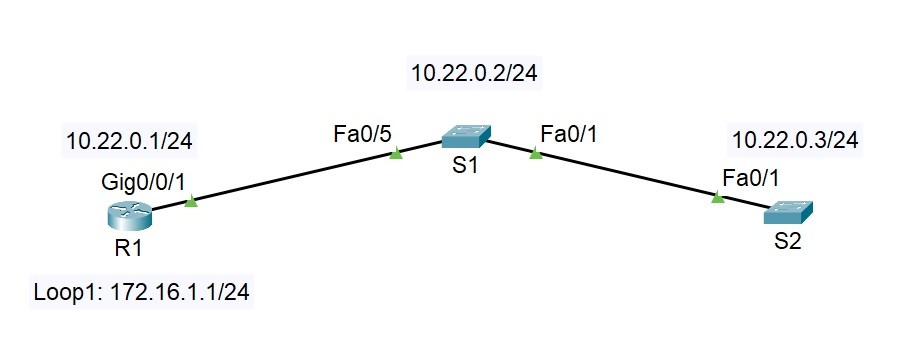
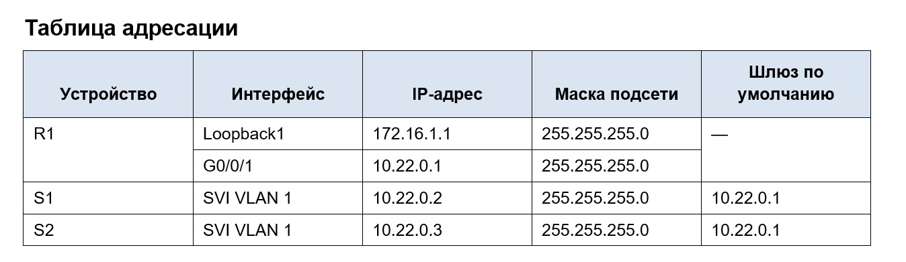

**_Лабораторная работа №13._**

*Настройка протоколов CDP, LLDP и NTP*

ТОПОЛОГИЯ

# Цели
    Часть 1. Создание сети и настройка основных параметров устройства
    Часть 2. Обнаружение сетевых ресурсов с помощью протокола CDP
    Часть 3. Обнаружение сетевых ресурсов с помощью протокола LLDP
    Часть 4. Настройка и проверка NTP

ВАЖНО: Native VLAN 666
-----------------------------------------------------

# Часть 1. Создание сети и настройка основных параметров устройства

1.1 - 1.3 Создали и настройка сети согласно топологии
Базовая настройка роутера и коммутаторов на основве файла настроек.

Меняем при внесении конфигурации только имя хоста оборудования согласно схемы: R!, S1, S2

    !
    service password-encryption
    !
    hostname S1
    !
    enable secret 5 $1$mERr$9cTjUIEqNGurQiFU.ZeCi1
    !
    banner motd ^C
    *******************************************************
    ****     Caution! Enter only adminstrator OTUS     ****
    *******************************************************^C
    !
    line con 0
    password 7 0822455D0A16
    logging synchronous
    login
    !
    line aux 0
    login
    !
    line vty 0 4
    password 7 0822455D0A16
    logging synchronous
    login
    line vty 5 15
    password 7 0822455D0A16
    logging synchronous
    login
    !
    end

 и сохраняем конфигурацию

    copy running-config startup-config 
    или
    write memory

# Часть 2. Обнаружение сетевых ресурсов с помощью протокола CDP

a.	На R1 используйте соответствующую команду show cdp, чтобы определить, сколько интерфейсов включено CDP, сколько из них включено и сколько отключено.
 
        R1#sh cdp
        Global CDP information:
            Sending CDP packets every 60 seconds
            Sending a holdtime value of 180 seconds
            Sending CDPv2 advertisements is enabled
        R1#

Согласно задания по указанной команде нельзя дать ответы на заданные вопросы т.к. нам выдается общее состояние протокола на устройстве. Изначально CDP работает на всех интерфейсах - это видно из нижеприведенной команды

        R1#show cdp interface 
        Vlan1 is administratively down, line protocol is down
        Sending CDP packets every 60 seconds
        Holdtime is 180 seconds
        GigabitEthernet0/0/0 is administratively down, line protocol is down
        Sending CDP packets every 60 seconds
        Holdtime is 180 seconds
        GigabitEthernet0/0/1 is up, line protocol is up
        Sending CDP packets every 60 seconds
        Holdtime is 180 seconds
        R1#

Вопрос: Сколько интерфейсов участвует в объявлениях CDP? 

    На R! согласно вышеприведенному ответу CDP включен на всех интерфейсах

Вопрос: Какие из них активны?

    Активен только 1 интерфейм.

b.	На R1 используйте соответствующую команду show cdp, чтобы определить версию IOS, используемую на S1.

        R1#show cdp entry S1

        Device ID: S1
        Entry address(es): 
        IP address : 
        Platform: cisco 2960, Capabilities: Switch
        Interface: GigabitEthernet0/0/1, Port ID (outgoing port): FastEthernet0/5
        Holdtime: 157

        Version :
        Cisco IOS Software, C2960 Software (C2960-LANBASEK9-M), Version 15.0(2)SE4, RELEASE SOFTWARE (fc1)
        Technical Support: http://www.cisco.com/techsupport
        Copyright (c) 1986-2013 by Cisco Systems, Inc.
        Compiled Wed 26-Jun-13 02:49 by mnguyen

        advertisement version: 2
        Duplex: full

Вопрос: Какая версия IOS используется на  S1?

    Version 15.0(2)SE4

c.	На S1 используйте соответствующую команду show cdp, чтобы определить, сколько пакетов CDP было выданных.
S1# show cdp traffic

    К сожалению данную комманду в эмуляторе Cisco Packet Tracer выполнить нельзя - ее нет в функционале программы

d.	Настройте SVI для VLAN 1 на S1 и S2, используя IP-адреса, указанные в таблице адресации выше. Настройте шлюз по умолчанию для каждого коммутатора на основе таблицы адресов.

        !
        interface Vlan1
        ip address 10.22.0.2 255.255.255.0
        !
        ip default-gateway 10.22.0.1
        !

Приведен пример настройки Vlan на S1

e.	На R1 выполните команду show cdp entry S1 . 

        R1#show cdp entry S1

        Device ID: S1
        Entry address(es): 
        IP address : 10.22.0.2
        Platform: cisco 2960, Capabilities: Switch
        Interface: GigabitEthernet0/0/1, Port ID (outgoing port): FastEthernet0/5
        Holdtime: 157

        Version :
        Cisco IOS Software, C2960 Software (C2960-LANBASEK9-M), Version 15.0(2)SE4, RELEASE SOFTWARE (fc1)
        Technical Support: http://www.cisco.com/techsupport
        Copyright (c) 1986-2013 by Cisco Systems, Inc.
        Compiled Wed 26-Jun-13 02:49 by mnguyen

        advertisement version: 2
        Duplex: full

Вопрос: Какие дополнительные сведения доступны теперь?

    Дополнительно виден IP адрес подсоединенного устройства

f.	Отключить CDP глобально на всех устройствах. 

        R1(config)#no cdp run
        R1(config)#do show cdp
        % CDP is not enabled

Пример выключения CDP на всех интерфейсах R1. Повторим эти комманды на S! & S2

# Часть 3. Обнаружение сетевых ресурсов с помощью протокола LLDP

На устройствах Cisco протокол LLDP может быть включен по умолчанию. Воспользуйтесь LLDP, чтобы обнаружить порты, к которым подключены кабели. Откройте окно конфигурации

a.	Введите соответствующую команду lldp, чтобы включить LLDP на всех устройствах в топологии.
На примере R1 введем комманды проверки и включения протокола LLDP на всех интерфейсах устройств нашей сети

        R1#sh lldp
        % LLDP is not enabled
        R1#conf t
        Enter configuration commands, one per line.  End with CNTL/Z.
        R1(config)#lldp run
        R1(config)#do show lldp

        Global LLDP Information:
            Status: ACTIVE
            LLDP advertisements are sent every 30 seconds
            LLDP hold time advertised is 120 seconds
            LLDP interface reinitialisation delay is 2 seconds

Изначально протокол не был включен (CDP ранее был выключен и 2 протокола одновременно не работают)

b.	На S1 выполните соответствующую команду lldp, чтобы предоставить подробную информацию о S2. 

S1# show lldp entry S2

    К сожалению данную комманду в эмуляторе Cisco Packet Tracer выполнить нельзя - ее нет в функционале программы

        Capability codes:
            (R) Router, (B) Bridge, (T) Telephone, (C) DOCSIS Cable Device
            (W) WLAN Access Point, (P) Repeater, (S) Station, (O) Other
        ------------------------------------------------
        Local Intf: Fa0/1  
        Chassis id: c025.5cd7.ef00 
        Port id: Fa0/1 
        Port Description: FastEthernet0/1
        System Name: S2

        System Description:
        Cisco IOS Software, C2960 Software (C2960-LANBASEK9-M), Version 15.2(4)E8, RELEASE SOFTWARE (fc3) 
        Technical Support: http://www.cisco.com/techsupport
        Copyright (c) 1986-2019 by Cisco Systems, Inc.
        Compiled Fri 15-Mar-19 17:28 by prod_rel_team 

        Time remaining: 109 seconds 
        System Capabilities: B
        Enabled Capabilities: B
        Management Addresses:
            IP: 10.22.0.3 
        Auto Negotiation - supported, enabled
        Physical media capabilities:
            100base-TX(FD)
            100base-TX(HD)
            10base-T(FD)
            10base-T(HD)
        Media Attachment Unit type: 16
        Vlan ID: 1

        Total entries displayed: 1

Вопрос: Что такое chassis ID  для коммутатора S2?

    Это уникальный идентификатор устройства, который в зависимости от версии ПО может соответствовать MAC-адресу устройства или нет. Используется для проверки состояния интерфейсов на устройстве по уникальному идентификатору, так и в системах мониторинга сети.

c.	Соединитесь через консоль на всех устройствах и используйте команды LLDP, необходимые для отображения топологии физической сети только из выходных данных команды show.

        R1#show lldp ne
        Capability codes:
            (R) Router, (B) Bridge, (T) Telephone, (C) DOCSIS Cable Device
            (W) WLAN Access Point, (P) Repeater, (S) Station, (O) Other
        Device ID           Local Intf     Hold-time  Capability      Port ID
        S1                  Gig0/0/1       120        B               Fa0/5

        Total entries displayed: 1

        S1#show lldp neighbors 
        Capability codes:
            (R) Router, (B) Bridge, (T) Telephone, (C) DOCSIS Cable Device
            (W) WLAN Access Point, (P) Repeater, (S) Station, (O) Other
        Device ID           Local Intf     Hold-time  Capability      Port ID
        S2                  Fa0/1          120        B               Fa0/1
        R1                  Fa0/5          120        R               Gig0/0/1

        Total entries displayed: 2

        S2#show lldp neighbors 
        Capability codes:
            (R) Router, (B) Bridge, (T) Telephone, (C) DOCSIS Cable Device
            (W) WLAN Access Point, (P) Repeater, (S) Station, (O) Other
        Device ID           Local Intf     Hold-time  Capability      Port ID
        S1                  Fa0/1          120        B               Fa0/1

        Total entries displayed: 1

# Часть 4. Настройка и проверка NTP

A. Проводим настройку NTP-сервера на R1 согласно задания

Узнаем первоначально время на роутере:

        R1#show clock 
        *0:36:2.368 UTC Mon Mar 1 1993

Устанавливаем текущее время:

        R1#clock set 10:38 22 apr 2026

потом запускаем сервер и устанавливаем его уровень - 4:

        R1(config)#ntp master 4

Синхронизируем календарь аппаратный с системным:

        R1(config)#ntp update-calendar 

И в конце просматриваем состояние настроенного сервера времени на роутере:

        R1#show ntp status 
        Clock is synchronized, stratum 4, reference is 127.127.1.1
        nominal freq is 250.0000 Hz, actual freq is 249.9990 Hz, precision is 2**24
        reference time is ED6A453C.0000019E (10:38:52.414 UTC Wed Apr 22 2026)
        clock offset is 0.00 msec, root delay is 0.00  msec
        root dispersion is 0.00 msec, peer dispersion is 0.12 msec.
        loopfilter state is 'CTRL' (Normal Controlled Loop), drift is - 0.000001193 s/s system poll interval is 4, last update was 9 sec ago.

B. Настраиваем S1 & S2 как клиенты для синхронизации времени с R1 (настройка для обоих устройств одинаковая, отобразим комманды для S1)

        S1(config)#ntp server 10.220.0.1

        S1#show ntp status 

        Clock is synchronized, stratum 16, reference is 10.22.0.1
        nominal freq is 250.0000 Hz, actual freq is 249.9990 Hz, precision is 2**24
        reference time is 2BB5B593.00000176 (20:54:43.374 UTC Fri Jun 13 2059)
        clock offset is 0.00 msec, root delay is 0.00  msec
        root dispersion is 10.65 msec, peer dispersion is 0.12 msec.
        loopfilter state is 'CTRL' (Normal Controlled Loop), drift is - 0.000001193 s/s system poll interval is 4, last update was 6 sec ago.

        S1#sh ntp associations 

        address         ref clock       st   when     poll    reach  delay          offset            disp
        *~10.22.0.1     127.127.1.1     4    5        16      377    0.00           0.00              0.12
        ~127.127.1.1   .LOCL.          6    2        64      377    0.00           0.00              0.12
        * sys.peer, # selected, + candidate, - outlyer, x falseticker, ~ configured

        S1#sh clock 
        11:24:2.356 UTC Wed Apr 22 2026

Вопрос для повторения: Для каких интерфейсов в пределах сети не следует использовать протоколы обнаружения сетевых ресурсов? Поясните ответ.

    Для граничных устройств. К примеру для нашей схемы если роутер является граничным устройством с другой сетью а коммутатор устройством провайдера, для того чтобы посторонние организации не знали по CDP & LLDP парметров граничного устройства на этом интерфесе CDP & LLDP отключаются

   
Файл схемы сети [здесь](Lab_13.pkt).

- [Вернуться на основную страницу ](/readme.md)

